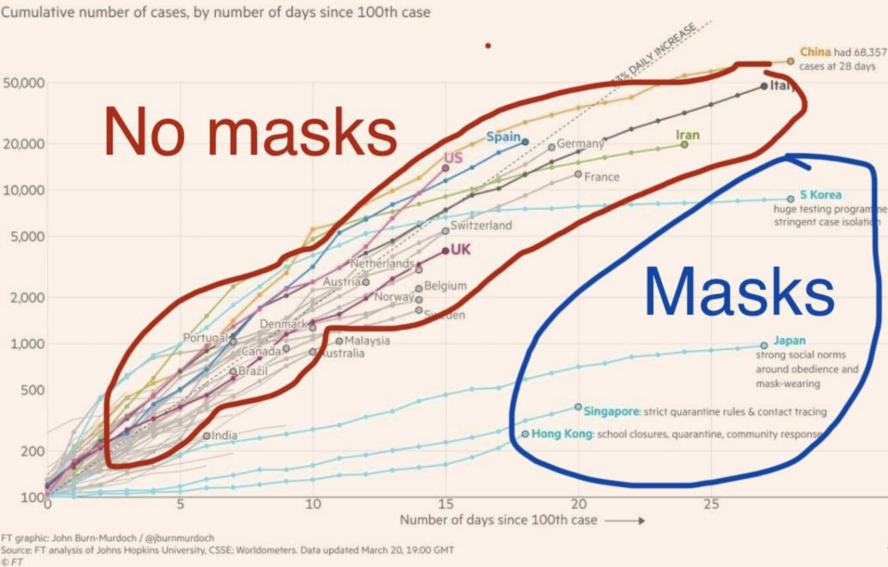

```{r setup, include=FALSE}
library(learnr)
knitr::opts_chunk$set(echo = FALSE)
```

## <!-- makes a new page, without a header or index entry -->

```{r, echo=FALSE, messages=FALSE}
NSW<- readRDS(file="images/NSWcases.Rda")
```

The following plot shows the number of confirmed cases of COVID-19 infection on each day in the state of New South Wales in Australia, since the 4th of March.

```{r, echo=FALSE, message=FALSE, warning=FALSE, fig.height=4, fig.width=4,  fig.cap = ""}
require(ggplot2)
NSWcor<-cor.test(as.numeric(NSW$date),NSW$cases) 
g<-ggplot( data = NSW, aes( date, cases )) + geom_point() + theme_bw() + ylab("Confirmed cases in NSW") + scale_x_date(date_minor_breaks=("1 days")) + ylim(0,NA)
show(g)
```

### 
###

```{r slope1}
question("What would a perfectly straight line on this plot indicate?",
    answer("The doubling time of the number of confirmed cases is constant.", message="No, that would be an exponential growth rather than linear."),
    answer("Each day, the number of confirmed cases increases by a constant percentage.", message="No, that would be an exponential growth rather than linear."),
    answer("Each day, the number of confirmed cases increases by the same amount as the previous day.", correct=TRUE),
    allow_retry = TRUE
)
```


```{r slope2}
question("Between 9 March and 23 March, what was the pattern for the increase in cases? ",
    answer("The cases increased steadily, at a constant rate.", message="No, that would only be true if the cases fell on a straight line."),
    answer("Quicker at the end of that period than at the beginning.", correct=TRUE),
    answer("Each day, the number of cases decreased by a constant percentage.", message="No, they certainly did not decrease."),
    #answer("They accelerated.", correct=TRUE),
    allow_retry = TRUE
)
```

## <!--Exponential comparison-->

Below, light blue dots have been added to the plot.

```{r, echo=FALSE, message=FALSE, warning=FALSE, fig.height=4, fig.width=4,  fig.cap = "" }
start<-22; pctIncrease<-20
NSW$exponential<-22
for(i in 2:length(NSW$date)) {
  NSW$exponential[i] <- NSW$exponential[i-1]*(1+pctIncrease/100)
}
h<-ggplot( data = NSW, aes( date, cases )) + geom_point() + theme_bw() + ylab("Confirmed cases in NSW") + scale_x_date(date_minor_breaks=("1 days")) + ylim(0,NA) + 
  geom_point(data = NSW, aes(x = date, y = exponential), color = "blue", alpha=.6) +
  annotate("text",x=as.Date("2020/3/28"),y=2250, label="20% daily growth", color="blue", size=3.5, angle=70)
show(h)
```

If the number of cases had increased by 20% each day, then the black dots (the real data) would fall exactly on top of the blue dots. In other words, the blue dots show the number of cases that would have occurred if there had been a 20% increase in cases each day. The raw numerical (not percentage) change in cases is greater for each day. This is because 20% of a larger number is greater than that of a smaller number. As a result, the graph becomes steeper and steeper as the number of cases grows.

```{r relativeToExponential}
question("What does the 20% comparison (the blue dots) indicate about the real data?",
    answer("The real cases increased steadily, at a constant rate."),
    answer("The real cases increased much more slowly than 20%/day at first, but from then on increased at a constant rate.", correct=TRUE),
    answer("The real cases increased at a faster than 20%/day rate"),
    answer("The real cases increased at close to 20% per day at first, but later increased more slowly.", correct=TRUE),
    allow_retry = TRUE
)
```

If the number of cases does grow by the same percentage each day, this is referred to as "exponential growth". It is what would occur if a person who is infected infects more than one other person on average. For 20% daily growth, on average each person would have to infect 1.2 others.

## Exponential growth

"Exponential growth" refers to when something increases by the same percentage over successive time points. Below, the data have been replotted with the vertical axis percent increase compared to the previous day rather than total number of cases. 

```{r, echo=FALSE, message=FALSE, warning=FALSE, fig.height=4, fig.width=4,  fig.cap = ""}
#Calculate proportional increase
increase<-diff(NSW$cases)
increase<-c(0,increase) #pad with 0 for first item
NSW$increase <- increase

NSW$increaseE <- pctIncrease #Because manual gets it slightly wrong probably because wrong starting date or something

#increaseE<-diff(NSW$exponential)
#increaseE<-c(0,increaseE) #pad with 0 for first item
#NSW$increaseE <- increaseE
excludeFirst <- tail(NSW,-1)

j<-ggplot( data = excludeFirst, aes( date, 100*increase/cases )) + geom_point() + theme_bw() + ylab("% increase in NSW confirmed cases") + scale_x_date(date_minor_breaks=("1 days")) + ylim(0,40) +
    geom_point(data = excludeFirst, aes(x = date, y = increaseE), color = "blue", alpha=.6)
show(j)
```

The blue dots now form a horizontal line, because they were created by calculating a 20% increase compared to the previous day.
The reason that virus infections can grow in this fashion is that each new person infected contributes an additional number of cases to the next day, by passing the virus on to more than one person (on average). Thus the new number of cases is some multiple (percentage added to) of the previous day's cases.

For the real data (the black dots), this graph makes it obvious that after about 23 March (when flights from overseas stopped and social distancing was put in place), no longer was there a similar percentage increase on each day. Instead, the percentage increase dwindled.

##
The below plot shows, for each day, the percentage increase in confirmed cases from the previous day.

```{r, echo=FALSE, message=FALSE, warning=FALSE, fig.height=4, fig.width=4,  fig.cap = "" }

NSWcori<-cor.test(as.numeric(NSW$date),NSW$increase/NSW$cases) 
h<-ggplot( data = excludeFirst, aes( date, 100*increase/cases )) + geom_point() + theme_bw() + ylab("Percent increase in NSW confirmed cases") + scale_x_date(date_minor_breaks=("1 days"))
show(h)
```

```{r pctage}
question("If the number of cases grew exactly exponentially, where would the datapoints be?",
    answer("On an accelerating curve.", message="That would be true if the vertical axis was number of cases, but not true with this percentage increase vertical axis."),
    answer("On a straight line with an upward slope."),
    answer("On a straight line with a downward slope."),
    answer("A flat horizontal line.", correct=TRUE),
    allow_retry = TRUE
)
```

## A logarithmic vertical axis

While the % increase vertical axis is useful, it unfortunately does not show the cumulative number of cases, only the change since the previous day. As a result, from that graph we don't see how high the caseload has gotten. This is one reason that people often use a logarithmic vertical axis in situations of constant (or even approximate) percentage growth.

On a non-logarithmic (linear) axis, a constant increase in *number* (not percentage) of cases results in a straight line. The greater the daily increase, the steeper the slope of the line. In other words, constant addition corresponds to a constant slope on a graph.

For the case of exponential growth, we are interested in knowing what the number of cases is being *multiplied by* each day, not how much is being added to it. In the case of 20% growth, for instance, on each day the number of cases is the previous number plus 20%, which can be calculated by multiplying the previous day's number of cases by 1.2.

Logarithms turn multiplication into addition, which means that on a logarithmic axis, stepping upward by a constant amount does not mean the number of cases has increased by the same number each time, but rather that it's been multiplied by the same number each time.

As a result, our 20% growth points fall on a straight line, because each successive point is a result of multiplying (rather than adding)
by a constant, namely 1.2.
```{r, semilogTwenty, echo=FALSE, message=FALSE, warning=FALSE, fig.height=4, fig.width=4,  fig.cap = "" }
k<-ggplot( data = NSW, aes( date, exponential )) + geom_point(color="blue",alpha=.6) + theme_bw() + ylab("Confirmed cases in NSW") + scale_x_date(date_minor_breaks=("1 days")) + ylim(0,NA) +  theme(panel.grid.minor.y = element_blank()) +
    annotate("text",x=as.Date("2020/3/15"),y=112, label="20% growth daily", color="blue", size=3, angle=46)
show(k + scale_y_log10() )
```

In the plot, notice that the vertical axis labels do not mark out equal intervals. That is, taking equal steps up does not result in adding one number over and over, a number corresponding to the step size. Rather, taking equal steps upward corresponds to *multiplying* by a number that reflects the step size. For the interval between the successive y-axis labels, for example, each is the previous label multipled by approximately three.

```{r, echo=FALSE, message=FALSE, warning=FALSE, fig.height=4, fig.width=4,  fig.cap = "" }
start<-22; pctIncrease<-30
NSW$thirty<-22
for(i in 2:length(NSW$date)) {
  NSW$thirty[i] <- NSW$thirty[i-1]*(1+pctIncrease/100)
}
start<-22; pctIncrease<-10
NSW$ten<-22
for(i in 2:length(NSW$date)) {
  NSW$ten[i] <- NSW$ten[i-1]*(1+pctIncrease/100)
}
mm<-ggplot( data = NSW, aes( date, exponential )) + geom_point(color="blue") + theme_bw() + ylab("Confirmed cases in NSW") + scale_x_date(date_minor_breaks=("1 days")) + ylim(0,NA) + 
  geom_point(aes(x = date, y = thirty), color = "red", alpha=.6) + 
  geom_point(aes(x = date, y = ten), color = "darkgreen", alpha=.6) + 
  theme(panel.grid.minor.y = element_blank()) +scale_y_log10() +
  annotate("text",x=as.Date("2020/3/13"),y=38, label="10% daily growth", color="darkgreen", size=3, angle=18) +
  annotate("text",x=as.Date("2020/3/15"),y=112, label="20% daily growth", color="blue", size=3, angle=32) +
  annotate("text",x=as.Date("2020/3/16"),y=370, label="30% daily growth", color="red", size=3, angle=42)
show(mm) 
```

The above plot shows that any particular daily growth rate (multiplication by a particular factor) results in a straight line of corresponding slope.

Adding the actual data from NSW (black dots), we can see that it was growing exponentially at nearly 20% for some time. After 28 March, growth was no longer exponential. That is, the data after 28 March do not fall on a straight line, of any slope (OK, at this point this is just hope).

```{r, semilogboth, echo=FALSE, message=FALSE, warning=FALSE, fig.height=4, fig.width=4,  fig.cap = "" }
h<-ggplot( data = NSW, aes( date, cases )) + geom_point() + theme_bw() + ylab("Confirmed cases in NSW") + scale_x_date(date_minor_breaks=("1 days")) + ylim(0,NA) + 
  geom_point(data = NSW, aes(x = date, y = exponential), color = "blue", alpha=.6) +
  #  geom_point(aes(x = date, y = thirty), color = "red", alpha=.6) + 
   # geom_point(aes(x = date, y = ten), color = "darkgreen", alpha=.6) + 
  scale_y_log10()
show(h)
```

Exponential growth is not always bad. Investments often yield exponential growth, because on average their value increases by some percentage each year. For example, the U.S. stock market increased on average 14% a year between 2000 and the end of 2019. If your parents had invested \$2000 for you in the year 2000, at the beginning of 2020 it would have been worth about \$27,000. 

```{r, compounding, echo=FALSE, message=FALSE, warning=FALSE, fig.height=4, fig.width=4,  fig.cap = "" }
stocks<-data.frame(
   date = seq(from = as.Date("2000/1/1"), to = as.Date("2020/1/1"), by = "year") )
stocks$val <- 2000
pctIncreaseStocks<- 14
for(i in 2:length(stocks$val)) {
  stocks$val[i] <- stocks$val[i-1]*(1+pctIncreaseStocks/100)
}
ss<-ggplot( data = stocks, aes( date, val )) + geom_point() + theme_bw() + ylab("Value ($)") 
show(ss)
```

Another way to get an intuition for what a particular growth rate means is to realize that each growth rate corresponds to a doubling every time a particular number of days elapses. The 14% growth rate of the stock market during the first twenty years of the century, for example, meant a doubling approximately every five years. Here I've added the doubling times to the 10, 20, and 30 percent growths.

```{r, doubleTimes, echo=FALSE, message=FALSE, warning=FALSE, fig.height=4, fig.width=4,  fig.cap = "" }
#1.20^(seq(1,8)) #Calculate doubling
#Calculate doubling time with 2=rate^doublingDays.   doublingDays = 2^(1/rate)

mm<-ggplot( data = NSW, aes( date, exponential )) + geom_point(color="blue") + theme_bw() + ylab("Confirmed cases in NSW") + scale_x_date(date_minor_breaks=("1 days")) + ylim(0,NA) + 
  geom_point(aes(x = date, y = thirty), color = "red", alpha=.6) + 
  geom_point(aes(x = date, y = ten), color = "darkgreen", alpha=.6) + 
  theme(panel.grid.minor.y = element_blank()) +scale_y_log10() +
  annotate("text",x=as.Date("2020/3/16"),y=50, label="10% daily growth, doubling about every 8 days", color="darkgreen", size=3, angle=19) +annotate("text",x=as.Date("2020/3/19"),y=240, label="20% daily growth, doubling about every 4 days", color="blue", size=3, angle=32) +
  annotate("text",x=as.Date("2020/3/20"),y=920, label="30% daily growth, doubling about every 3 days", color="red", size=3, angle=44)
show(mm)
```

## Population density and flu mortality

[Hoffman & Cox](https://bioone.org/journals/Transactions-of-the-Kansas-Academy-of-Science/volume-122/issue-3-4/062.122.0301/The-1918-1920-H1N1-Influenza-a-Pandemic-in-Kansas-and/10.1660/062.122.0301.full?casa_token=TtDsr1exh58AAAAA%3apcP2D8e87Ap0vYATPNofQCiq8zgIp8b0MKMHjn_awr9KMYZ7Mc65AKRiwnFi6aZrro9m6xvGYQDG) here plot data from the 1918 flu pandemic. Their plot shows the mortality rate against the population density for different counties in Kansas and Missouri.

```{r, echo=FALSE, out.width = "400px"}
knitr::include_graphics("images/log1918MortalityKansasVsLogPopDensity.png")
``` 

Not only is the vertical axis logarithmic on this plot, but also the horizontal axis is logarithmic. But you don't need to worry about that to answer the following questions.

```{r KansasMissouriCorrelatn}
question("From this plot, what do you think is the relationship between population density and mortality rate?",
    answer("No relationship", ), 
    answer("Positive correlation", correct=TRUE),
    answer("Negative correlation"),
    allow_retry = TRUE
)
```

What causal statement might people suspect to be true from the data in this plot?

```{r KansasMissouriCausation}
question("From this plot, what do you think is the relationship between population density and mortality rate?",
    answer("No relationship", ), 
    answer("Positive correlation", correct=TRUE),
    answer("Negative correlation"),
    allow_retry = TRUE
)
```

## Inferring causation

```{r, echo=FALSE, out.width = "400px"}
knitr::include_graphics("images/log1918MortalityKansasVsLogPopDensity.png")
``` 

So far, we have discussed inferences of causation from correlations, where the correlation is evident from a scatterplot of Y against X, and people tend to infer that X caused Y.

The correlation of Y with X and X with Y are by definition the same, so in principle a plot like that of the above is just as consistent with Y causing X as with X causing Y. However, in some cases a causal link is much more plausible in one direction than in another. For example, it is plausible that higher population density causes a higher rate of flu deaths. A more detailed causal model is that population density causes more frequent physical contact between people, which causes more flu transmission, which causes more deaths.

But could Y cause X? That is, could flu deaths cause higher population density? That's is not very plausible, illustrating that with some pairs of variables, causation in only one direction is likely

## Many points means more evidence

```{r, echo=FALSE, out.width = "400px"}
knitr::include_graphics("images/log1918MortalityKansasVsLogPopDensity.png")
``` 

Scatterplots typically have lots of data points.  If they form a fairly consistent pattern of Y increasing or decreasing with X, this provides a lot of evidence for a correlation, which is what one wants before making the further leap to imputing a causal relationship. 

## A plot from the news media

Consider this plot produced by John Burn-Murdoch of the Financial Times.

```{r, echo=FALSE, out.width = "750px"}
knitr::include_graphics("images/30MarCovid19CasesFT.png") #You can't change the image directory for Shiny apps

#Calculate rate for a particular doubling time
#2 = rate^doublingTime
#rate = 2^(1/doublingTime)
``` 

This plot has a logarithmic vertical axis, so going up a particular distance corresponds to multiplying by a particular factor. One feature you haven't seen before perhaps is that the axis labels are not at equal multiplicative intervals, in order to position them at round numbers.

```{r us}
question("Consider the U.S. data, shown in light purple. For the first fifteen days or so after its 100th case, how fast were the number of confirmed cases growing?",
    answer("Exponentially, doubling about every 2 days.", correct=TRUE),
    answer("Linearly, doubling about every 2 days."),
    answer("Linearly, increasing by the same number of cases each day, on average."),
    allow_retry = TRUE
)
```

##
```{r, echo=FALSE, out.width = "750px"}
knitr::include_graphics("images/30MarCovid19CasesFT.png") #You can't change the image directory for Shiny apps

#Calculate rate for a particular doubling time
#2 = rate^doublingTime
#rate = 2^(1/doublingTime)
USrate = round( (2^(1/2)  -1) * 100  )
``` 

Doubling every two days, as the U.S. was doing for the first two weeks here, corresponds to a `r USrate`% daily growth rate.

##

```{r, echo=FALSE, fig.cap="https://twitter.com/jperla/status/1243349875015553024", out.width = "750px"}
 #You can't change the image directory for Shiny apps
``` 


```{r ideaimage}
question("What theory do you think the person who scrawled on this image wished to encourage you to believe?",
    answer("Masks prevent COVID-19 cases from growing exponentially.",message="No, because the lines in the Masks group are fairly linear on this semi-log plot, indicating that they are growing exponentially, just slower than the masks ones"),
    answer("COVID-19 cases encourage mask wearing."),
    answer("Wearing a mask slows the rate of infections.", correct = TRUE),
    answer("Masks are an important dependent variable"),
    allow_retry = TRUE
)
```

## Causal inference

```{r, echo=FALSE, fig.cap="https://twitter.com/jperla/status/1243349875015553024", out.width = "750px"}
 #You can't change the image directory
``` 

```{r ideaimage3}
question("'Wearing a mask slows the rate of infection' is an example of:",
    answer("An inescapable conclusion."),
    answer("A correlational statement."),
    answer("A causal statement.", correct = TRUE),
    answer("A very ambiguous statement.", message="I don't see anything particularly ambiguous about this."),
    answer("An independently variable statement.", message= "This sentence doesn't mean anything, as far as I know."),
    allow_retry = TRUE
)
```

## 

```{r, echo=FALSE, fig.cap="https://twitter.com/jperla/status/1243349875015553024", out.width = "750px"}
 #You can't change the image directory
``` 

The person who scrawled on this figure is encouraging people to make the causal inference that wearing a mask reduces the spread of COVID-19 infection.

```{r ideaimage2}
question("'How many countries with a high rate of mask wearing is the causal inference based on?",
    answer("1."),
    answer("2."),
    answer("3."),
    answer("4.", correct=TRUE),
    answer("5."),
    allow_retry = TRUE
)
```

In order to be confident that a statistical correlation is present between two things,  many data points are usually needed, which are typically plotted on a scatterplot. After establishing a statistically significant correlation, one may make the further leap to a causal model, keeping in mind the pitfalls of inferring causation from correlation.

```{r ianotherFactor}
question("What are two pitfalls of inferring that X causes Y from a correlation between an X and Y variable?",
    answer("A third factor may cause both of the variables that are correlated.",correct=TRUE),
    answer("Correlations are subject to kurtotic doubling.",message="Kurtotic doubling is not a thing."),
    answer("Y may cause X.", correct=TRUE),
    answer("X minus Y is often more likely.", message="This option makes no sense in this context."),
    allow_retry = TRUE
)
```

## 

```{r, echo=FALSE, fig.cap="https://twitter.com/jperla/status/1243349875015553024", out.width = "750px"}
 #You can't change the image directory
``` 

The inference from this plot that masks cause less spreading of infection based on only four instances of mask-wearing countries. The fewer the number of instances, the more likely it is that a third variable could explain the difference between the two sets of countries.


```{r notherFactor}
question("Other factor(s) that might explain some of the difference between the blue-circled countries and the red ones:",
    answer("Climate.",correct=TRUE),
    answer("Handshaking customs.",correct=TRUE),
    answer("Government diligence in testing and tracing contacts of COVID-19 patients.", correct=TRUE),
    answer("Responsiveness of population to government recommendations.", correct=TRUE),
    answer("Quarantine policy.", correct=TRUE),
    allow_retry = TRUE
)
```

## 

```{r, echo=FALSE, fig.cap="https://twitter.com/jperla/status/1243349875015553024", out.width = "750px"}
 #You can't change the image directory
``` 

There are many kinds of differences between countries, from genetic to cultural to environmental and governmental. As a result, the most likely explanation for the lower infection growth rate of the four blue-circled countries is a combination of causes, one of which *may* be masks. The evidence here that masks are a cause therefore is weak.

In an exponentially-growing pandemic, however, one doesn't have time to wait for strong evidence! One has to do something. Actually, one should do lots of things that may plausibly combat the crisis. Wearing masks is a plausible cause of reduced transmission, so it probably is a good policy to adopt.

## 

```{r, echo=FALSE, out.width = "400px"}

``` 


```{r multivariate}
question("What standard approach might be used to try to estimate the effects of mask wearing and temperature?",
    answer("Multivariate regression.",correct=TRUE),
    answer("Standard deviation."),
    answer("Regression to the mean."),
    answer("Post hoc ergo propter hoc.", message="I don't see anything particularly ambiguous about this."),
    allow_retry = TRUE
)
```

