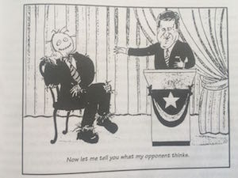

## Important Readings

* To find some definitions of the terms in the Vocabulary section, open   [Vocab_ReadingsATHK2017ArgumentsThinking.Rmd](https://raw.githubusercontent.com/alexholcombe/teachingATHK/master/Vocab_ReadingsATHK2017ArgumentsThinking.Rmd) and you'll see definitions in the comments, embedded in "\<!-- \-->", something like `<!--- comment text -->`. 
Quiz yourself with this webpage that doesn't show the definition, and subsequently check the definition in the .Rmd version to see if you got it right.  

* *The power of critical thinking* by Vaughn, Chapter 1, http://opac.library.usyd.edu.au/search/r?SEARCH=ATHK1001
(or Chapters 2 and 3 of Bassham et al.'s *Critical Thinking*)

* [*Introduction to Logic and Critical Thinking*](http://open.umn.edu/opentextbooks/BookDetail.aspx?bookId=457) by Van Cleave, Chapter 1, in particular 1.6 (Validity), 1.7 (Soundness), 1.8 (Deductive vs. inductive arguments), 1.9 (Missing premises)

* Common logic mistake associated with [affirming the consequent](https://www.logicallyfallacious.com/tools/lp/Bo/LogicalFallacies/14/Affirming-the-Consequent)

* Common logic mistake associated with [denying the antecedent](https://www.logicallyfallacious.com/tools/lp/Bo/LogicalFallacies/77/Denying-the-Antecedent) 

* *Think Critically* by Facione, Chapter 6: Evaluate the Credibility of Claims and Sources, http://opac.library.usyd.edu.au/search/r?SEARCH=ATHK1001

<!-- Critical Thinking, by Paul and Elder -->

* *ArgumentsIntro* on Elearning in the **Lectures:Alex's stuff** folder.

* [Galef on confirmation bias](http://ideas.ted.com/why-you-think-youre-right-even-when-youre-wrong/), which she refers to as **soldier mind**

## Not-as-important Readings

* *The power of critical thinking* by Vaughn, Chapter 3. 

* *Critical thinking* by Bassham et al., Chapter 3. Basic logical concepts: deduction and induction.

# Vocabulary

* Enthymeme

<!-- From Greek "in-mind", because the full argument in the mind is not stated. Usually a condensed syllogism where one premise is not explicitly stated.
E.g., "Socrates is mortal because he's human." instead of the usual 
"All humans are mortal. 
Socrates is human. 
Therefore, Socrates is mortal."
-->
* Casting arguments

<!-- Finding and isolating or diagramming the conclusion, premises and logical structure of an argument, usually from natural text -->

* Necessary versus sufficient

* Syllogisms

* Validity

* Soundness

* Deduction

* Induction

* Strong

* Cogent

* Circularity

* dogmatism

* Survivorship

* Confabulation

<!-- Dissensus  -->

## Vocab

* Appeal to authority
* Straw man
    * 
* Fallacy of the single cause. 
<!-- This is related to the fallacy of denying the antecedent  -->
* Moving the goalposts
* [No true Scotsman](https://en.wikipedia.org/wiki/No_true_Scotsman)
<!-- No true Scotsman. An "ad hoc rescue" of a refuted generalization attempt-->
* [Overwhelming exception](https://en.wikipedia.org/wiki/Overwhelming_exception) Ali G [example](https://www.youtube.com/watch?v=SZ6k8tddDxg#t=02m01s)
* Confirmation bias
* Soldier mind 
* My-side bias
<!-- Confirmation bias, soldier mind, and my-side bias are practically synonyms -->
* [Motivated cognition](https://alexholcombe.github.io/teachingATHK/readings/motivatedCognition.html)

