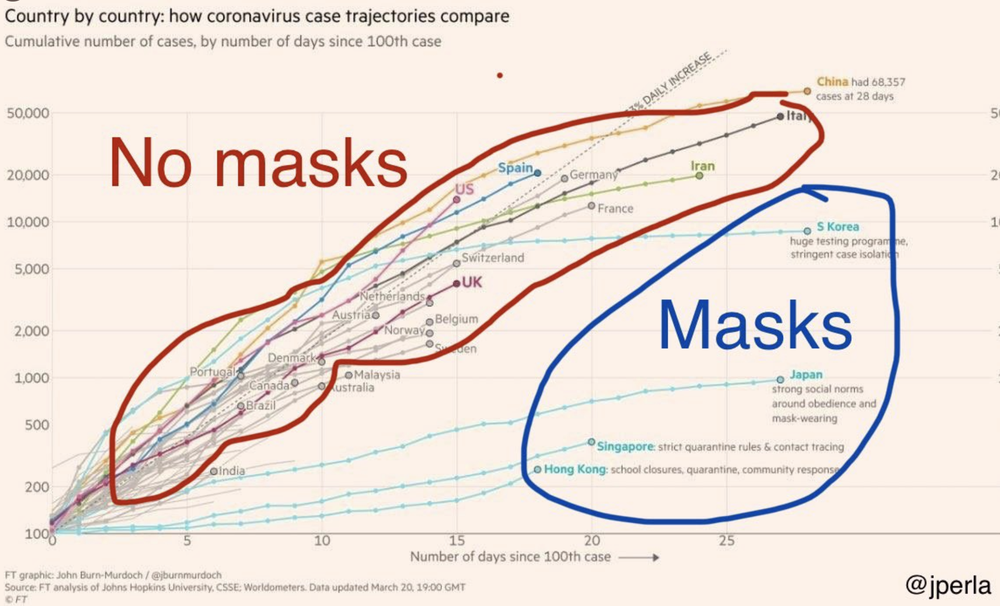
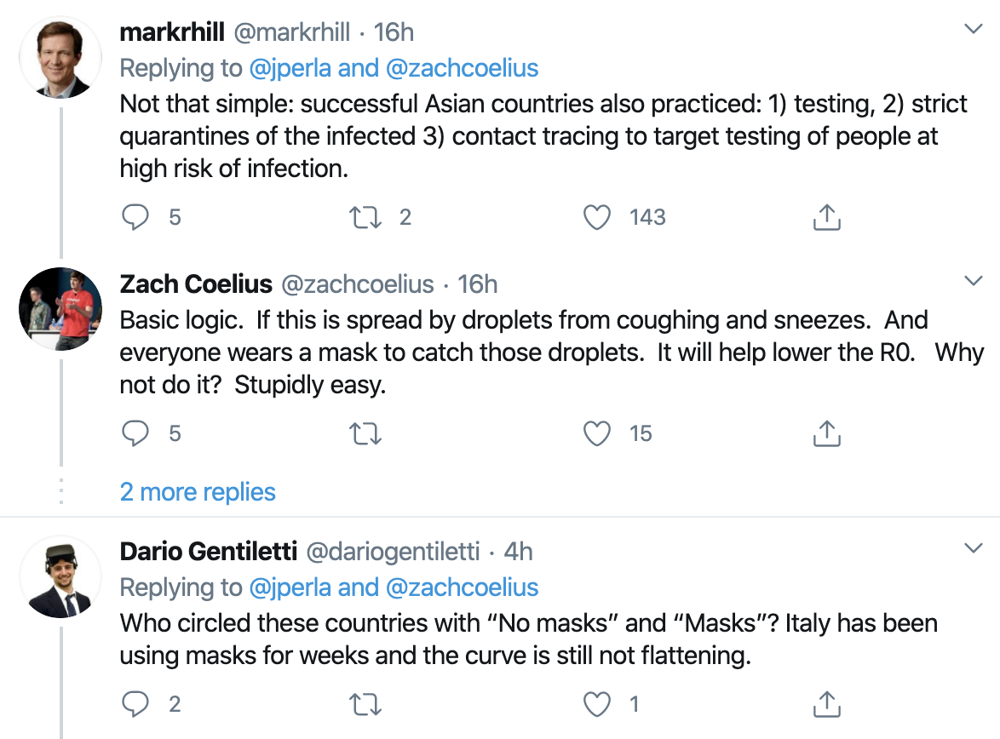

```{r setup, include=FALSE}
knitr::opts_chunk$set(echo = TRUE)
```


```{r, echo=FALSE, message=FALSE, warning=FALSE, fig.height=4, fig.width=4,  fig.cap = "" }
NSW<-data.frame( cases= c(22,25,28,36,40,47,60,64,77,91,111,133,170,209,267,307,353,436,533,669,818,1029,1219,1405,1617,1791) ) #19 March
#NSW$increase = c(0, 6, 8, 4, 7, 13, 4, 12, 14, 20, 14, 22, 37))  
NSW$date <- seq(as.Date("2020/3/4"), by = "day", length.out = length(NSW$cases))
require(ggplot2)
NSWcor<-cor.test(as.numeric(NSW$date),NSW$cases) 
g<-ggplot( data = NSW, aes( date, cases )) + geom_point() + theme_bw() + ylab("Confirmed cases in NSW") + scale_x_date(date_minor_breaks=("1 days")) + ylim(0,NA) +   annotate("text",x=as.Date("2020/3/25"),y=900, label=">100 cases\n from\n Ruby\n Princess",size=1.7)

show(g)
```

## With regression line and r

```{r, echo=FALSE, message=FALSE, warning=FALSE, fig.height=4, fig.width=4,  fig.cap = "" }

g<-ggplot( data = NSW, aes( date, cases )) + geom_point() + theme_bw() + ylab("Confirmed cases in NSW") + scale_x_date(date_minor_breaks=("1 days")) +
  geom_smooth(method='lm', fill=NA) +  ylim(0,NA) +
  annotate("text",x=as.Date("2020/3/7"),y=100, label=paste0("r=",round(NSWcor$estimate,2)), parse=FALSE) 
show(g)
```

### As proportion

```{r, echo=FALSE, message=FALSE, warning=FALSE, fig.height=4, fig.width=4,  fig.cap = "" }

#Calculate proportional increase
increase<-diff(NSW$cases)
increase<-c(0,increase) #pad with 0 for first item
NSW$increase <- increase
excludeFirst <- tail(NSW,-1)
NSWcori<-cor.test(as.numeric(NSW$date),NSW$increase/NSW$cases) 
h<-ggplot( data = excludeFirst, aes( date, 100*increase/cases )) + geom_point() + theme_bw() + ylab("Percent increase") + scale_x_date(date_minor_breaks=("1 days")) +
  geom_smooth(method='lm', fill=NA) + 
  annotate("text",x=as.Date("2020/3/16"),y=13, label=paste0("r=",round(NSWcori$estimate,2)), parse=FALSE)
show(h)
```

### Semi-log plot suggests early part is supra-exponential.

```{r, echo=FALSE, message=FALSE, warning=FALSE, fig.height=4, fig.width=4,  fig.cap = "" }

show(g + scale_y_log10())

```

<!---
Flat-line correlation non-intuitively is high
```{r, echo=FALSE, message=FALSE, warning=FALSE, fig.height=2, fig.width=2,  fig.cap = "" }

flatLine<- data.frame( x=c(2,3,4), y=c(4,4,4.00000001) )
flatCor<-cor.test(flatLine$x,flatLine$y) 

ggplot(flatLine,aes(x,y))+
  geom_point() +geom_line() +theme_bw() + ylim(3,5) +
    annotate("text",x=3,y=4.5, label=paste0("r=",round(flatCor$estimate,2)), parse=FALSE)
```
-->

## Causal reasoning about COVID-19 transmission

Consider this 
```{r, echo=FALSE, out.width = "400px"}

``` 
https://twitter.com/jperla/status/1243349875015553024

```{r, echo=FALSE, out.width = "400px"}

``` 

But, with an exponentially-growing pandemic, we don't have time to wait for strong evidence.
