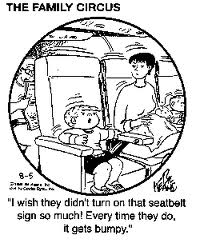
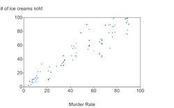

<!-- TUTORS: Students should work on some of these in groups, 
and may want to google things
-->

### Learning Outcomes

Understand: IV vs DV, Confound, Controlled variable

IV vs DVs. [1-min video](https://www.youtube.com/watch?v=rU7l5FkIHus) 

Confounds.  
<!--Old video is wrong in that doesnt' draw exercise as the mediating variable https://www.youtube.com/watch?v=B7QdNYLp_E0 -->

### Study elements

Term | Definition | Murder - ice cream relationship | Self-quiz - exam relationship | Liberals - Darks relationship |
------------- | ------------- | ------------- | ------------- | ------------- |
Dependent variable (DV) | The behavior or outcome that is measured. It is expected to change as a result of changes in the IV. |  | | |
Independent variable (IV) | Variable with two or more levels chosen by the researcher. Changes in the IV are expected to be related to changes in the DV. |  | | |
Confound (Bruce mentioned "omitted variables" in the context of linear regression, which can act like a confound) | Variable that changes with the IV. The DV could be affected by both the IV and/or the confound, so we cannot conclude that the IV was affected by the DV. |  | | |
Controlled variable (in an experiment) | Varies, but is not different for the different levels of the IV. Any effects it has will "cancel out". |  | | |

<!--The word "confound" is usually used for experimental studies, while "omitted variable" is usually used for non-experimental (e.g., correlational) studies -->

<!--The confound usually becomes the "controlled variable" because you design the experiment to control for it-->
 

As you go through the examples below, fill out the three right columns of the table.

### Confounds  

Over the year, murder rates and ice cream sales are highly positively correlated. That is, as murder rates rise, so does the sale of ice cream. 

Like any correlation between one variable (X) and another (Y), there are three possible explanations:  

1. X causes Y
1. Y causes X
1. A third factor is involved. 

  

Which explanation is most plausible? _______________________________

  

Under the third-factor explanation, what could the third factor be and what might its relationship to the others? 

 
._________________________________________________________________   
 
________________________________________________________________

 
<!-- * There is a third variable — a **confound** — which causes the increase in BOTH ice cream sales AND murder rates.
     + temperature 
-->

How could we test this explanation? ________________________________________________________________  

 
________________________________________________________________

 
Can you think of any way, even if implausible, that murder rate could cause ice cream sales or vice versa? 

 
________________________________________________________________  

  
________________________________________________________________

<!-- The students should get this very quickly, because we talked about the correlation between ice cream sales and swimming pool deaths in class 
* Murder causes ice cream sales. How? Possibly,
     + Bereaved relatives splurge on ice cream as a result of their grief. 
     + Murdering someone causes ice cream cravings.
     + Can you think of another possible causal link?
* Ice cream sales cause murder. How? Possibly,
     + Ice cream can cause "brain freeze", which can cause a violent reaction.
     + Another?

-->

***

**Confound**: Consider a relationship between two variables, X and Y, with higher levels of X associated with higher level of Y. A confounding variable is an extraneous variable that is statistically related to (or correlated with) the X. This means that as X changes, the confounding variable changes along with it. 

Above, we referred to the confound as a **third factor**.

***

### Correlation and causation  

<!-- Evidence for these things can come from a simple correlation, a quasi-experiment (better), or a fully randomised experiment (best)
Be impressed if the students think of quasi-experiments.
-->

#### For A groups to discuss

A lecturer finds that online self-quiz completion rate is highly positively correlated with final exam mark. 

On the basis of this evidence, the lecturer says to the students, "You should complete the self-quiz because it will significantly improve your chances of getting a good exam grade."

Describe a plausible alternative explanation of the evidence   _____________________________________________________________________________________________________

  

<!-- Students who are motivated enough to do the self-quiz are also motivated enough to study for the exam. **Motivation** may be a confound.
There may not be any significant benefit of completing the self-quiz. Instead, the correlations may be entirely (or nearly entirely) caused by motivation.
-->

On your alternative explanation, what causes what? ____________________________________________________
<!--Motivation causes more self-quiz completions.
Motivation causes more studying, which causes higher exam marks.
-->
   
How might you determine which theory is correct?

 
._____________________________________________________________________________________________________

  _____________________________________________________________________________________________________

  
If you have time remaining, try to conceive of a *second* alternative explanation.  
 
._____________________________________________________________________________________________________
 

***

#### For B groups to discuss

Students in the Sydney University Liberal Club compare their course marks to the students of Sydney University's Dark Alternative Society and a t-test indicates that the Liberals get significantly higher marks. 

The Liberals conclude that they work harder than the Dark Alternatives, are smarter than them, or both.  
<!--This example is completely made-up, but you can tell them that towards the end rather than right away :) -->
  

Describe a plausible alternative explanation of the evidence ____________________________________________________
<!--Maybe Liberals take courses that are easier. Maybe Liberals cheat more. Maybe tutors or lecturers discriminate against Dark Alternatives -->

    
On your alternative explanation, what causes what? ____________________________________________________
<!--E.g., Some personal factor that causes one to be Liberal also causes one to take easier courses, e.g. maybe business-oriented types are more likely to be Liberal and maybe those classes are easier.
(Different courses across the university may award similar proportions of HDs, Ds, Credits, etc. That means however that if the average student in a course is less intelligent or less motivated, it is easier to get a high mark in that course)
-->
   
How might you determine which theory is correct?  
 

 -________________________________________________

   ____________________________________________________

***

 

### Finding things out, with Facts, Stats, Logic, and Science 

You will see several statements. For each, write down: 

(@) What kind of evidence would be relevant to evaluate each claim.
(@) Whether it's a correlational study or an experiment that you're thinking of, write down two specific variables you'd examine the link between.
(@) Major confounds likely to be involved, if any?
(@) What can be done to address the confounds? 
(@) An experiment to address the issue (even if practically impossible to conduct).
(@) Whether the above experiment is possible and feasible or impossible.
 
    
<!-- end of list -->
*** 
    
Divide into groups, each group getting one or two of the below.
Describe the kind of evidence that would be relevant to the numbered statements below (p.91 of Fundamentals of Critical Thinking has similar material). 

1. Background: The police give more tickets to drivers of red cars. Statement to evaluate: The reason is that red cars attract attention, so the police are more likely to notice a red car violating the law.
<!--Tell the students to assume that it is true that red cars get more tickets.
Alternative explanation: People who drive red cars may drive more quickly and/or break more laws.
In other words, 
		- selection bias, omitted variable
		
Experiment to address the issue: conduct a "sting" on the highway patrol. Unbeknownst to them, shut down the road where they are sitting waiting for speeders. Then send several cars driving by them with professional drivers, with some red. See whether they are more likely to give tickets to the red cars.
Note that while this experiment avoids the confound of red car drivers being more likely to break the law, this experiment assesses only whether it is really the redness causing the tickets, not whether it's happening because of greater noticing - the causal mechanism in the statement. So ideally an experiment would somehow measure noticing.
-->
2. Crystal meth (ice) is the drug of choice on the streets today.
<!--Crystal meth.  How much police haul in each year.
Poll on the streets. But will the people polled lie? Maybe they are biased to not admit meth is their favorite.
The drug they buy may not be their top preference, because the drug bought is affected by availability, not just preference.  So maybe should ask them which they’d get if they could, the "drug of choice".-->
3. Humanities classes at the University of Sydney are marked more leniently than science classes.
<!-- Useful to go through controlled experiment scenario:
- Randomly assign students to a humanities or science class. This is gold standard evidence for establishing causality
- Don't let the lecturers know this experiment is going on, to avoid them changing what they do.
- Check the student marks at the end.
- Which classes? all of those offered by Sydney Uni?  Probably infeasible, have to choose some. How to avoid bias?
- Random assignment is intended to result in same proportion of science-inter
- Does average class size of humanities and science classes differ? That could be a confound, where the results of the experiment cause yield the result that humanities classes are easier, but the actual cause may not be the humanity of it but rather the smaller sizes of the classes.
- Class criticising argument as a group
-->
4. Background: Male drivers have significantly more accidents than female drivers. As a result, insurance companies in many countries charge males more. Statement to evaluate: Males are worse drivers than females.
<!--Being male rather than female causes accidents. In other words, males are worse drivers
Alternatively, 
- Males may drive more miles. The background does not indicate whether males have more accidents per mile driven or simply more accidents in total.
- Males may drive faster on average. In a sense that may make them "worse drivers" but if you somehow forced females to drive at the same speed, possibly they'd have *even more* accidents.
- Males may drive more dangerous vehicles (perhaps trucks and sports cars somehow encourage accidents regardless of sex of the driver?
-->
5. Driving a car is more dangerous than flying in a commercial airliner.
<!-- 	Number of people who die per year in auto accidents is much larger than number who die in an airliner.
But, that's not the relevant number. Instead, some *rate* of accidents is more relevant, because there are many more car trips than airline trips.
It is irrational to fear flying a significant distance, if you are willing to drive that same distance without such trepidations, because your risk of injury or death is 10 to 40 times greater in an automobile than in an airliner, in the safer areas of the world. He found that over the fifteen years between 1975 and 1994, the death risk per flight was one in seven million. Barnett, judges the actual risk of one person being involved in a fatal airline accident, to be once every 19,000 years, provided he flew on an airliner once each day of those 19,000 years. He bases that estimate on what actually happened in the domestic U.S., during the 1990s. http://anxieties.com/flying-howsafe.php#.Vtd9ZJN97UI  http://airlinesafety.com/faq/FearFlying.htm
Some graphs of airline fatalities (between a few hundred and a few thousand per year): http://edition.cnn.com/interactive/2014/07/travel/aviation-data/

Also see http://www.meretrix.com/~harry/flying/notes/safetyvsdriving.html
-->
### Remember

* Experiment versus quasi-experiment versus simple correlation
* Quasi-experiments are sometimes referred to as natural experiments
* Only a controlled experiment can definitively establish causality

<!-- IGNORE EVERYTHING BELOW

Extraneous variable
General term for a variable that changes concomitantly with the IV.

Nuisance variable
Variable that causes DV scores to be more variable

### Confounds versus noise-adding nuisances

This is an advanced topic.

The reason **confounds** prevent 

- Candidate explanation generation, then testing
	- Whichever line you join, the other lines appear to move faster.
		- Something about the way people choose lines, on average they mistakenly choose the slower line?
		- You only notice / remember the times when your line is not moving the fastest.
		- Your line may move just as often, but when it moves, you move with it which doesn’t look as fast (visual illusion) as when another line is moving while you are standing still.
		- 
		- 
		- 
- Evaluating sources
	- continuation of lecture table for evaluation. Best friend: “You really need to do something about how much you drink at parties.”
	Parent to daughter in year eight: “No, it is not a good idea to go out with a high school junior.”
	Co-worker to new employee: “Come on, everybody here gambles on the AFL on their office computer.”
	Roommate: “The apartment manager was looking for you this morning.”
	 Doctor to patient: “The lab test came back positive.”
	- Evaluate based on the schema.
	- 
- worksheet on classifying fallacies
- Sources of arguments, pieces to evaluate
	- Marijuana legalisation.
	- Boil down the argument in “Don’t blame the burgers”, p.225 of Basham 3rd edition.
		-  Rambling, talks about lots of stuff. Which is the point. Almost all articles are like that. Gay marriage one is kind of an exception.
	- Students are shown a short article online, from a newspaper or something. They have to answer the questions below, in an online quiz as short-answer questions
		* Your task is to evaluate the claim “More innocents die when we don't have capital punishment” which forms the title of the below piece written by Dennis Prager.
		- Please answer the following questions with one or two complete sentences.
			- What is the logic of Prager’s claim?
			- What evidence does he provide?
			- Is the information accurate?
			Has the author given sources for his/her information?
			Is the article a scholarly or popular treatment?
			What do you know about the author? Is he or she an authority on the topic addressed in the book?
			Has the author interpreted information fairly? Is the basis for the interpretation clearly stated?
			Has the author defined terms clearly?
			Has the author argued logically, or has he or she used ad hominem arguments, faulty cause and effect, either/or reasoning or faulty generalizations?
			Has the author made conclusions that go beyond the scope of his or her study?
			What are the author's assumptions about his or her audience or subject? Are they clearly stated or implicit?
			What is the nature of the source? What is the political or critical stance of the journal or book your source comes from?
			Is the source current?
			What do reviews have to say about the source?
			Is the author's research design valid? What type of controls has he or she used? Has he or she taken account of uncontrolled variables?
			Is the article relevant to your topic?

-->