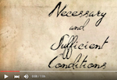
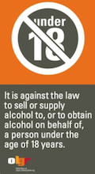

<!-- TUTORS: there are explanations and additional examples of the topics below in the lecture slides.
* You should have the lecture slides at the ready to go back through, when it's clear some students don't understand something.
* I suggest doing the first two syllogisms together as a class, and then having them do a bunch together in pairs, before discussing them again as a class.
* Also be aware of the ArgumentsIntroHandout on eLearning, and the Vocab_and_Readings handout on eLearning
-->

### Learning Outcomes for this and the next tutorial

**Understand**: 

Tutorial 1. Necessary and sufficient, Validity, Soundness, If-then statements, Syllogisms

Tutorial 2. Real-world syllogisms, Deduction versus Induction, Strong, Cogent, and Circularity.

 

### Necessary versus sufficient 

A **necessary** condition for something (X) means that X cannot be true unless the condition is true.

A **sufficient** condition for X means that if the condition is true, then X is true.

 [movie](https://www.youtube.com/watch?v=fq_DwgmIadw)

*****

<!--Watch the video https://www.youtube.com/watch?v=fq_DwgmIadw -->
Example A:  
A table's having four sides is a **necessary**, but not a **sufficient**, condition for it being square.  

Example B: Being a square is **sufficient**, but not **necessary**, for having four sides.

Example C: For winning the OzLotto lottery, a ticket is a **necessary** but not **sufficient** condition for winning.

1. For humans to live, air is:

A) Necessary
B) Sufficient
C) Necessary and sufficient
<!--It's necessary, but not sufficient. It's not sufficient because there are lots of other things required for humans to live, such as temperature being below that of the sun's surface, g-forces being below a certain limit, etc.-->

*****

2. For winning the OzLotto lottery, winning is a _______________ condition for the condition of having a ticket.
A) Necessary but not sufficient.
B) Sufficient but not necessary.
C) Necessary and sufficient.
<!--It sounds backwards in time and that can be confusing, but doesn't affect the logic.
It's sufficient but not necessary. You can have a ticket without having won - there are other situations (losing) besides winning in which you also have a ticket. -->

*****

**If, then statements** frequently are critical ingredients to arguments. Be sure you understand how they relate to **necessary** and **sufficient**:

> If you have a full NSW driver's license, you can enrol to vote in NSW.

According to the above, 

3. is having a full NSW driver's license **sufficient** to vote in NSW?  _________________  

4. is having a full NSW driver's license **necessary** to vote in NSW?  _________________

<!-- If then statements don't necessarily mean that the condition is necessary.
In fact, you can also vote if you don't have a driver's license but do have a "a NSW photo card" issued by RTA
http://www.elections.nsw.gov.au/voting/on_election_day/types_of_voting
Thus, an if statement does not mean that the condition after the if must be necessary. -->

To indicate that a driver's license is *necessary* as well as sufficient, you'd have to add to the statement, yielding something like:  

> Only if you have a full NSW driver's license, you can enrol to vote in NSW. And the driver's license is enough; you don't need anything else.  

The first sentence of the above indicates the **necessary** part; "only" signifying that a driver's license is necessary, with no other ID allowable. And the second sentence indicates the **sufficient** part.  We can make this shorter by writing something like: 

> If (and only if) you have a full NSW driver's license, you can enrol to vote in NSW.  

When people talk informally, "if and only if" is sometimes what they mean by "if". But not always, and unfortunately we can be certain of what the consequences of their claim is only if we know whether they meant "if and only if". For the purposes of this tutorial, we will assume that sentences mean no more than they say: "if" means something is **sufficient** but does not mean that it is **necessary**.

*****

> If you jump in a pool of lava, you will die.

According to the above statement,

5. is jumping in a pool of lava sufficient to die? __________________  
<!--yes-->
6. is jumping in a pool of lava necessary to die? __________________  
<!--no. The claim did not specify "if and only if", probably because there are other ways to die-->

*****

> If you are over 65 years old, you will get a 10% discount.

According to the above statement,

7. is being older than 65 sufficient to get a 10% discount?  __________________  
<!--yes-->
8. is being older than 65 necessary to get a 10% discount? __________________  
<!--no, because it doesn't say "if and only if", it does not exclude that there might be other ways to get a 10% discount -->

*****

> If A, then B. ("A" stands for any statement, and "B" stands for any other statement).

According to the above statement,

9. is A sufficient for B?  __________________  
<!--yes-->
10. is A necessary for B? __________________  
<!--no. There might be other ways for B to be true -->

Notice that it doesn't matter what A and B are, the implication of "If, then" is the same. This is fundamental to logic. Separating logical structure (if, then) from actual content makes it easier to determine if the logic is ok (the argument is **valid**) before we worry about whether A is true, and whether the connection to B is true. This is a real skill - most people never get beyond their reaction to whether they agree with the conclusion.

*****

> If you are 18 or over, you can legally drink.

According to the above, 

11. is being 18 or over sufficient to legally drink? __________________  
<!--yes-->
12. Is being 18 or over necessary to legally drink? __________________  
<!--no-->

In the above, you may be inclined to answer yes for the necessary question, that being 18 or over is necessary to drink. But notice that the way the statement is worded - as an "If, then" statement - does *not* imply that being 18 or over is **necessary** to drink, only that it is sufficient!

  
Here is how the government phrases the restriction:   

> It is against the law to supply alcohol to a person under 18.  

13. Rewrite the statement as an *if, then* sentence: ________________________________________________________
<!--If a person is under 18, it is illegal to supply them alcohol -->

Consider the implications of the  sentence: 

14. Is a person being under 18 **sufficient** to make supplying them alcohol illegal?
 __________________  
<!--yes-->
15. Is a person being under 18 **necessary** to make supplying them alcohol illegal? __________________  
<!--no. There might be other people for whom it is illegal to supply alcohol, like an already-very-drunk person. The statement doesn't speak to that.-->

This could be rewritten, in more familiar if-then form as  

> If a person is under 18, it is against the law to supply them alcohol.

*****

Below are some statements.  Rewrite each one in the form of **If A, then B**. Then, indicate whether the first part (A) is **necessary** as well as **sufficient** for B.

16. Smoking ice (methamphetamine) seems great if you don’t consider the consequences. 
<!-- If you don't consider the consequences, smoking ice seems great.
Not considering the consequences is a sufficient condition for smoking ice seeming great-->
  

17. You can drive a car if you don’t speed.
<!--If you don't speed, you can drive a car. 
Not speeding is a sufficient condition for driving a car. (in actual fact, there are other restrictions on driving, so this is not true in the real world)
-->
 

18. There’s no rest for the wicked.  
<!-- If one is wicked, they get no rest. 
Being wicked is sufficient for getting no rest.
Notice it does not imply that being wicked is sufficient for getting no rest. There might be other types that get no rest -->

19. All convicts have their fingerprints taken.  
<!-- If one is a convict, one gets one's fingerprints taken.
Being a convict is sufficient (but perhaps not necessary) for getting fingerprints taken -->

20. Owls fly.
<!-- For this one, you can argue that because the sentence doesn't specify "all" owls, it could be referring to only some owls. But for this class, we will assume if not specified, e.g. with something like "some", then the statement means "all". 

If something is an owl, it flies.
Being an owl is sufficient for flying.
-->

<!--For arguments of the form If A, then B, the A is always sufficient but not necessary for the B.
-->
 

*****

An important aspect of **If A, then B** statements is that although they do not imply that A is necessary for B, they do imply that B is necessary for A. Because whenever A is true B is true, therefore if A is true, B must also be true.

For example, recall

> If a person is under 18, it is against the law to supply them alcohol.

"it is against the law to supply someone alcohol" is **necessarily** true if that someone is under 18. 

Go back through two of the other **If, then** statements above and below write about what is necessarily true.  
  

21. _________________________________________________________________________________________ 
  

22. _________________________________________________________________________________________  
  

23. _________________________________________________________________________________________  

### Necessary AND sufficient  

As we have seen, strictly speaking an **If A, then B** statement implies that A is sufficient for B and that B is necessary for A, but *not* that A is necessary for B.

To signify that A is *both* sufficient and necessary, you'd have to write something like 

> If and only if A, then B.

The above statement means that A being false *does* mean that B is false. In other words, A being true is necessary for B to be true. The below is another way to express this:

> If A, then B.  If B, then A.  

<!--B can only occur when A is true, thus B is sufficient for A to be true-->
 
Understanding that a simple **If X, then Y** statement doesn't mean that X is *necessary* for Y is good to remember in real-world thinking because it can remind you to consider what *else* might be able to cause Y.

You can also write it this way, which means the same thing:

> B if and only if A.

For example,

A triangle is isosceles if and only if the base angles are equal.

24. Are the base angles being equal **sufficient** for a triangle to be isosceles?  NO / YES / INADEQUATE INFORMATION
<!--yes-->
 
25. Are the base angles being equal **necessary** for a triangle to be isosceles? NO / YES / INADEQUATE INFORMATION  
<!--yes-->

 

## Syllogisms

Now that we have a strong sense of necessary and sufficient, we can string multiple statements together into an argument and formally evaluate the argument.  

A syllogism is a deductive argument made up of two premises and a conclusion. Often, one of the premises is an if-then statement.

> All books purchased at Berkelouw bookstore are sold new. I purchased these books from that store. Therefore, I purchased these books new.

26. What are the premises? Circle them.

27. What is the conclusion? Circle it with a dashed line.

If a syllogism is **valid**, the conclusion follows inescapably if the premises are true.  

28. Is the above syllogism **valid**? ____________ 
<!--yes-->

Another way to think about **validity** is that when the argument is valid, the premises are **sufficient** for the conclusion to be true.

If a syllogism is **sound**, the conclusion follows inescapably if the premises are true, **and** the premises are true.  

29. Is the above syllogism *sound*? ______________  
<!--DISCUSS WITH CLASS. Depends on whether Berkelouw has any used books, which I don't know -->

***  

> When the RBA reduces the interest rate, our company's revenue for the following month is higher. The RBA reduced the interest rate yesterday. Our revenue for next month will be higher.

30. What are the premises? Circle them with a solid line.

31. What is the conclusion? Circle it with a dashed line.

32. Is the above syllogism *valid*? _____________

33. Is the above syllogism *sound*? _____________
<!--We don't know. -->

 

> If we put an astronaut on Mars before the end of the 20th century, then we have a successful space program. We have a successful space program. So, we put an astronaut on Mars before the end of the 20th century.

34. What are the premises? Circle them.

35. What is the conclusion? Circle it with a dashed line.

36. Is the above syllogism *valid*? ____________ 

This example exploits a mistake that some people make. In the previous syllogisms, the second sentence affirmed the "A" part of the **if A then B** statement (it said that "A" was true), and the third sentence followed. 

With this Mars astronaut example, instead of saying that the "A" part is true, the second sentence said that the "B" part is true. Saying that the B part is true is called **affirming the consequent**. B is called the **consequent** because it is the consequence of A being true.

But contrary to the excerpt above, affirming the consequent doesn't imply anything about A! Thus, this argument is **not valid** - the conclusion does not follow from the premises being true.

37. Is the Mars astronaut argument *sound*? ______________  
<!--No, all invalid arguments are also unsound -->

### Validity in Syllogisms

A syllogism usually consists of an "if A, then B" statement, often followed by a second statement about either A or B, followed by a conclusion. 

The second statement (about A or B) can say either A is true, B is true, A is false, or B is false. What conclusion is justified from each of these four possibilities?

2nd Statement | Technical term |  Justified conclusion | Common mistake
------------ | ------------ | ------------- | -------------
A is true | Affirming the antecedent | B is true | N/A
B is true | **Affirming the consequent** | None | A is true
A is false | **Denying the antecedent** | None | B is false (might be other ways to get B)
B is false | Denying the consequent | A is false | N/A

You should be familiar with each of these to avoid making mistakes.

Don't forget that the table refers to what makes an argument *valid* - the conclusion justified *if* the premises are true. To know if the argument is *sound*, we have to know whether the premises are true.
    

***  

#### Affirming the Consequent  

> If it's raining then the streets are wet.
The streets are wet.
Therefore, it is raining.

The above syllogism is not valid. It makes the common mistake (highlighted in the table) of concluding A is true if B i true.

There are other things besides rain that can make the streets wet. The conclusion would only be true if rain was a necessary condition, but an if statement signals only sufficient conditions.

*****

>If I have the flu, then I have a sore throat.
I have a sore throat.
Therefore, I have the flu.

38. Is the above syllogism *valid*? ____________ 
<!-- No, the first premise doesn't exclude the possibility that there are other ways besides the flu to get a sore throat -->

39. What is the name of the logical mistake that can lead to the statement "Therefore, I have the flu."?

***
 
The conversation below is from *Timon of Athens* by William Shakespeare.

**Flavius**: Have you forgot me, sir?  
**Timon**: Why dost ask that? I have forgot all men;
Then, if thou grant’st thou’rt a man, I have forgot thee.

 
Write Timon's statement as a syllogism with two premises and a conclusion. This may be difficult but have a shot at it:  

40. Premise: __________________________________________________________________________
   

Premise: __________________________________________________________________________________

   
Conclusion: ___________________________________________________________________________  

<!-- Premise: I have forgot all men.
Premise: Flavius art (archaic English for "is") a man.
Conclusion: I have forgot you.
-->
