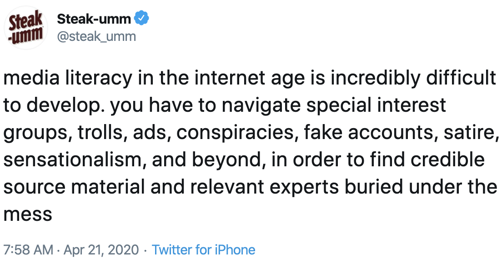
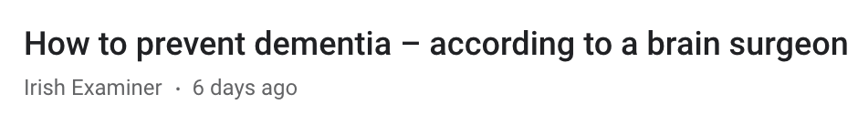
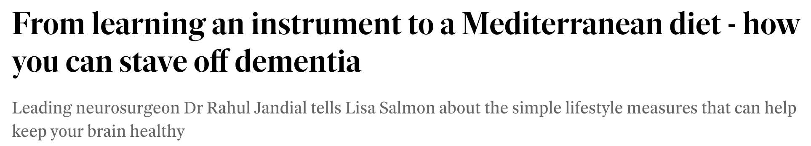
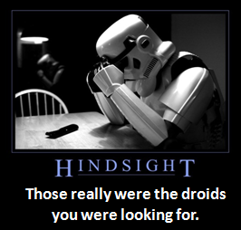
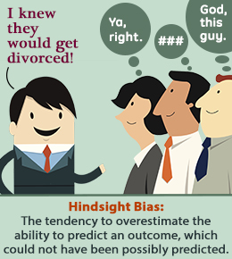

```{r setup, include=FALSE}
knitr::opts_chunk$set(echo = TRUE)
```
(this document is updated as the weeks proceed)

* Intro `r statsStudies=5` video to Alex Holcombe, find it in Canvas

Week 7: Stats and studies: Correlation and causation <!--statsAndStudies PPT-->

<!-- Correlation and causation video -->
<!-- Confound or nuisance variable? video -->
* Correlation and causation intro
  * Learning objectives:
    * Understand and apply three causal models to explaining correlations
    * Know the term "spurious correlation" 
* Where does data come from?
* Understanding correlation more deeply
  * Correlation of X with Y same as Y with X
  * Measurement and correlation
    * Correlation not affected by changes in units
  * [When linear correlation is not appropriate: COVID-19](https://alexholcombe.github.io/teachingATHK/correlation_COVID19.html)

* Three causal models
  * X causes Y, Y causes X, a third variable causes both
* Causal model can be at any level of detail

<!--Slide #45-->
* Explanatory, Outcome, and Nuisance variables
  * Recall IV and DV. Bruce slide:
```{r, echo=FALSE, out.width = "220px"}
knitr::include_graphics("imagesForRmd/Bruce_IV_DV_slide.png")
```
  * [Nuisance variable](https://dictionary.apa.org/nuisance-variable)
    * Is not different, on average, for the different levels of the variable we are interested in
  * [Confound](https://www.students4bestevidence.net/blog/2018/10/01/a-beginners-guide-to-confounding/) variables
    * Different for the different levels of the variable we are interested in.
    * Bruce slide:
```{r, echo=FALSE, out.width = "220px"}
knitr::include_graphics("imagesForRmd/BruceConfoundsSlide.png")
```
  * Can you distinguish between confounds and nuisance variables?
  * Random assignment
    * Bruce slide:
```{r, echo=FALSE, out.width = "220px"}
knitr::include_graphics("imagesForRmd/BruceRandomizedControlledExperiments.png")
```
* Randomisation and control group
  * Bruce slide
```{r, echo=FALSE, out.width = "200px"}
knitr::include_graphics("imagesForRmd/bruceSlide147randomAssignment.png")
```

* Time as a third variable
  * Relationship between pirates and high average temperature is confounded by time. 
* Time: Post hoc ergo propter hoc (After this therefore because of this) fallacy

Week 8 <!--statsAndStudies PPT-->

* Dichotomous correlation
  * dichotomous variables and correlation
  * Contingency tables <!-- Manly Chapter 7 Causes, illusory correlations -->
  * Later you will see the link to arguments and logic

* 4 kinds of control
  * Statistical adjustment - [controlling for](https://alexholcombe.github.io/teachingATHK/readings/controllingForVsControl.html) confounds
  * A controlled variable - matching
* Causal phrases verus correlational phrases, see "Distinguish correlational and causal.." video on Canvas

```{r, echo=FALSE, out.width = "160px"}
knitr::include_graphics("imagesForRmd/correlationVsCausalVerbs.png")
```    

  * Recognizing correlational studies in the news
  * Controlling for in regression and multicollinearity

* Epidemiology
  * Smoking has a big effect,
  * Nutrition effects are small
  * Many false positives, which we'll explain later

Week 9 

* Hypothesis testing review and extension
  * Review of hypothesis testing (recall tutorial week 5 and Bruce's 18 March lecture)
  * Bruce slide:
```{r, echo=FALSE, out.width = "220px"}
knitr::include_graphics("imagesForRmd/BruceSignificPvalueDefintn.png")
```  
  * False positives, false negatives, true positives, true negatives
  * Hypothesis testing and medical testing
    * Sensitivity and specificity
  
* Why does the news have lots of false positives? 
  * Excess of statistical comparisons
  * More reasons given later in the class, after logic and arguments

###  Arguments and logic , Week 9-10

We're going to go back and forth between bare-bones examples and arguments from the wild, giving you more and more tools to deal with the real-world ones.

* Most arguments are people just trying to win - to get what they want. Persuasion.
* But sometimes you don't just want to win, you actually want to learn and find things out.
* We need to know good reasons for believing things. Ideally,
  * Assumptions are true
  * Logic must be airtight (inescapable)
* Syllogisms introduction
  * Suppositionally inescapable; inescapable
* Truth contingency tables 
* Necessary and sufficient
* Syllogisms 
  * Suppositionally inescapable, inescapable, suppositionally solid, solid

* Real-world arguments and Casting an argument
  <!--* Socrative poll about vegetarianism-->
  * Decoupling and biased evaluation
* Implicit premise
* Redundant premise
* Poly-syllogism

* Mindset for real-world (4 slides)
  * I will happily change, for I seek the truth - Aurelius.
* Loose language in the wild
  * hyperbole
  * principle of charity (related to steel man which comes later)

* Deduction and induction
  * Process of elimination, Sherlock Holmes
  * Abduction
* Mindset again - System 1 vs. System 2 [reading](https://www.apa.org/monitor/2012/02/conclusions)
* Casting the we must bomb Iran argument
* Deduction and induction in science
  * [reading](https://www.livescience.com/21569-deduction-vs-induction.html)
* Analysing scientific abstracts
* Analysing the Molly and Bea argument

###  Arguments and reasoning in the wild, Weeks 11-13

Week 11: Fallacies. <!-- "8_9_10_Fallacies" folder with Keynote file -->

* Informal fallacies
* Post hoc ergo propter hoc, again
  * [Video](https://www.youtube.com/watch?v=5A7hSaoRv0g) combining this fallacy with deductive and inductive logic. Good way to bring previous bits of the class together!

* Ad hominem "To the person": 
  * Puerile name-calling <!--Include a Gilbert tweet -->
  * Questioning the motive
  * Hypocrite
  * You’re not entitled to speak on that
  * Appeal to authority
* Straw man
  * Relation to principle of charity
* Fallacy of the single cause <!-- Relation to affirming the consequent -->
* Circularity
* Minimising evidence against
  * Overwhelming exception
  * No True Scotsman
* Slippery slope

Week 12 - `r wk10=0` <!-- "confirmationBias" Keynote -->

* Wason card selection task, as an argument/syllogism `r wk10=wk10+ 18` <!-- 18 slides -->
  * [Confirmation bias](https://www.verywellmind.com/what-is-a-confirmation-bias-2795024)
  * Cheater detection framing
  * Self-explanation
  * Group discussion
* Mindset again: Biased evaluation - confirmation or "my-side" bias `r wk10=wk10+ 7` <!-- slides -->
  * It stops search for possibilities (Manley chapter 2)
  * Francis Bacon was concerned, so he invented science
  * Mercier & Sperber
  * Info sources that tend to use opposing experts
  * Not invented here
* Overconfidence `r wk10=wk10+ 28` <!-- slides -->
  * https://web.csulb.edu/~cwallis/382/certainty/chapter19.html
  * Most of us think we're above average
  * Making judgments when not expert
  * Student logic exam results
  * Dunning-Kruger effect 
  * Planning fallacy <!-- 7 slides -->
* `r wk10` slides above for this week


* Why does the news have lots of false positives? <!--slides 168 to 180-->
  * Excess of statistical comparisons (already talked about this)  
  * Publication bias <!-- Make a "false positives" video -->
  * <!-- Link to syllogisms: This conclusion is probably true, if there isn't lots of contrary evidence (that we're not seeing) and if they did their statistics right and if... -->
  * P-hacking
    * <!-- The following rule accurately matches the results of every US presidential election since 1932: the incumbent party will win the election if and only if the Washington Redskins won their last home game before the election – unless the incumbent is black or the challenger attended a Central European boarding school, in which case it will lose.” -->
  * Preregistration
  * Expectancy effects  <!--slides 181 to 191-->
    * Experimenter
    * Participant
    * Addressing expectancy effects
```{r, echo=FALSE, out.width = "160px"}
knitr::include_graphics("imagesForRmd/blindingEffectFromPSYC1.png")
```     
  * Experimentation effect

Week 13

* Who to believe <!-- whoToBelieve Keynote file -->
  * [Telling fact from fiction in the news](https://theconversation.com/can-you-tell-fact-from-fiction-in-the-news-most-students-cant-102580)
    * 
```{r, echo=FALSE, out.width = "210px"}
 #https://twitter.com/steak_umm/status/1252355987249303555
```    
Great thread answering Soledad O'Brien: https://twitter.com/temanue/status/1252358692424437763
https://twitter.com/steak_umm/status/1253514561128402944

  * Ensure your mouth and throat are always moist. Stomach acid can kill coronavirus. It's just the flu. China created COVID-19 as a biological weapon. At least 60 per cent of the population needs to be exposed to build up "necessary resistance" to the virus. From [this](https://www.smh.com.au/business/companies/the-other-viral-problem-in-the-covid-19-pandemic-online-misinformation-20200318-p54bd3.html) 
  * [Only about 30% of Australians](https://www.smh.com.au/business/companies/the-other-viral-problem-in-the-covid-19-pandemic-online-misinformation-20200318-p54bd3.html) checked with other sources of info before sharing something
    * OK but there are other signals of credibility
    * And background knowledge
  * Argument from authority
    * Bias: Incentive, and circumstantial ad hominem
    * Track record
      * Postdiction versus prediction “ Heyman notes that Gottman doesn’t predict divorce at all. He postdicts it. He gets 100 (or however many) couples, sees how many divorced, and then finds a set of factors that explain what happened."
    * Experts
    * Expertise: area of expertise
```{r, echo=FALSE, out.width = "210px"}

```
      * Success bias p.10 of Mercier - Makes sense in small-scale societies
      * Advertising typically uses respected people, often outside of their area of expertise <!-- TETLOCK: I think a lot of good executives have the intuition that you get more out of a team of forecasters or problem solvers if you elicit independent judgments initially that are uncontaminated by conformity pressure, and then you create an environment in which ideas can be freely critiqued before lifting the veil of anonymity and letting people see who’s taking which positions. -->
    * Multiple independent experts
    * Wikipedia (pp.263-5 of Lyons & Ward)
    * Fake experts
    * "Fact or Fake news? Evaluating Sources" OLEO1645 by Michelle Harrison
    * "Evaluate the credibility of claims and sources" from *Think Critically* by Facione
    <!-- Contains 12 criteria for evaluating the credibility of  the source of a claim. But it's a lot and not well-structured, so should probably use something else -->
  * Video is a favorite of fake news
  * - Connecting correlation interpretation to base rate neglect.  Do it before section on media - say “and both base rate neglect and media stuff takes us back to correlations because we’re getting more data in some of the cells of the 2 x 2 than others” 

 
* Conversations <!-- "conversations" Keynote file -->
  * Mindset: humility
  * Why people don't change their mind much
* The naive view
  * Challenging a person's ideas with facts will cause them to change their position
  * The best thing to do is point to exactly where they are wrong
* Why people don't change their mind
  - Don't want to admit they were wrong
  - Confirmation bias
    * Add some examples from https://www.verywellmind.com/what-is-a-confirmation-bias-2795024
  - Knew-it-all-along effect (hindsight bias)
    *  Ideally people would learn from their mistakes. But often humans show the knew-it-all-along effect.
    
  * ADD Media bias - section 5.3 of Manley
    * Incentive to make research more meaningful than it is
      * Just says in mice
      * Causation in headline when it's an observational study
        * Look back at Distinguishing correlational and causal statements video for an example
        * [Example](https://www.belfasttelegraph.co.uk/life/health/from-learning-an-instrument-to-a-mediterranean-diet-how-you-can-stave-off-dementia-39068893.html)
```{r, echo=FALSE, out.width = "220px"}

```  
  * ADD Research media bias - publication bias (Bruce slide #130) and file drawer problem - section 5.3 of Manley
  * The internet
    * No gatekeeper or vetting (p. 256 of Lyons & Ward) +1
      * Unvetted sites can look just as slick as vetted sites, not true in the old days
    * Google Pagerank (crowdsourced vetting) +1
    * extremism (rare people can find and reinforce each other) +1
    * Anonymity 
    * Spurious corroboration (sites copying each other)

## Having an argument can extremize both sides


## Taking a specific criticism as a general one

Don't leave your shoes in the middle of the floor

You always leave your shoes in the middle of the floor


## Avoiding entering argument mode

[Daniel Pink on How to Persuade Others with the Right Questions](https://www.youtube.com/watch?v=WAL7Pz1i1jU)

<div class="notes">
This guy

I'm not one of those people who went into psychology because they wanted to deal with *feelings*

What I'm into is evidence, reasons and logic. But I've learned I can only have those conversations with certain people if I deal with their feelings.
</div>

<!--
## Self-challenge

Something about indigenous people
Something about race
Something about free speech
Why should someone believe in your religion rather than another?
Are you in favor of a law prohibiting discrimination in hiring and public accommodations (including toilets) based on an individual’s gender identity? The opposition says it would protect sexual predators by allowing men to enter women's restrooms.
Taxes should be raised to increase public school budgets.
A tax on sugar and sugary drinks should be introduced to combat obesity.
Abortion (pro-life or pro-choice)
Gay marriage should be legal
Should it be illegal to discriminate in hiring and against transgender people?
Should handguns be illegal?
Should the government give money to private schools?
People should have the right to end their lives (euthanasia)
Australia should be a republic
Marijuana and cocaine should be legal

## It's hard

“people don’t change their mind very easily, and when they are persuaded to think differently, the effect is usually temporary,” Don Green

- why is that number right for you?
- you’re trying to avoid an argument of any kind. If you’re only sharing stories with them, there’s no way you can argue with that. No conflict takes place and there’s no potential for the backfire effect to set in.
- It’s a way to elicit them to form a reasoned opinion for the first time. Done in a way that saves face, where there never has to be a visible moment where they decided they were wrong about their initial opinion.

## Reciprocity

-->


### Probably won't get to the below

Base rates, probabilities, and correlations   <!-- TENTATIVELY TRYING OUT IN DECKSET? -->

* How probabilities are presented
* Probabilities versus frequencies
  * When you hear a probability, think of 100 or 1000 cases
* Correlations seemingly implied by rates <!-- (Ch. 7 of Manley)-->
  * Which bits of the contingency table are given by a particular statement?


Is there a correlation between being male and liking avocados?

Suppose we learn that most males like avocados and also that most people who like avocadoes are male. Can we conclude that liking avocadoes is correlated with being male? It's tempting to think the answer is "yes." Understanding why that's the wrong answer is crucial to having a full understanding of correlation.

For two dichomotous variables like male/female and liking avocados versus not, a positive correlation would mean that a higher proportion of males like avocado than females.

We know two things
* Most males like avocado
* Most people who like avocado are male

To establish a correlation, what we need to know is whether males like avocados at a higher rate than females do. But that simply does not follow from the fact that most males like avocados and most who like avocado are male. Look at this example:
	
 Like Avocado      Male  Female     
--------------     ----- ------
     No             40     38
    Yes             60     58

Table:  Number of males versus females who like and don't like avocados

Most males in this example

What proportion of males like avocados? <!--40%-->
What proportion of females like avocados

*	Most people in the world like avocados. So we should expect most males to like avocados even if the same proportion of males and females like avocados.
*	Most people in the world are male (by a small amount). So we should expect most avocado eaters to be male even if males and females like avocados at the same rate.


	Putting these two facts together still doesn't give us a correlation, because they could both be true even if males and females own cell phones at the same rate. 
		- Make a 2 x 2 table. For base rate of each - being male and owning a cellphone. <!-- See Chapter 7, Manley -->

Most northern Hemisphere residents have above world average income.
Most people with above world average income are in the northern hemisphere.

Most N. Hemisphere countries have more than 300 COVID-19 deaths.
Most countries with more than 300 COVID-19 deaths are in the Northern Hemisphere.
Is there a correlation between being in the N. Hemisphere and having more than 300 COVID-19 deaths?
Maybe not, because most countries are in the N. Hemisphere anyway, so the second statement doesn't tell us much. We need more to know whether the proportion of northern hemisphere countries with >300 COVID-19 deaths is greater than the proportion of southern hemisphere countries.

		- Another kind of mistake is simply that we fail to think proportionally. For example, suppose we've only observed John when it's cold and we notice that he has worn a hat 70% of the time. Can we conclude that there is a correlation in our observations between his wearing a hat and cold temperatures? Of course not! What if he wears a hat 70% of the time regardless of the temperature? In that case, there is no special correlation between his hat wearing and the cold: he just loves wearing hats.
		
		If we are told, "Most of the time when it's cold, John wears a hat," it's easy to forget that this is not enough to establish a correlation. To infer a correlation, we have to assume that John does not wear a hat most of the time on other days too . Maybe this is a safe assumption to make, but maybe not. The point is that if we just ignore it, we are neglecting the base rate, a mistake we encountered in the previous chapter. 


  
## Learning from mistakes



> - This stormtrooper has realized that he made a big mistake.
That's good because then he can learn from the mistake.

## The knew-it-all-along effect


Related to not wanting to admit that one is wrong.




<div class="notes">
This guy

- In retrospect thinks he knew it all along
- The observers are skeptical. They are probably right that he didn't predict this.
- But in retrospect, people think that they did predict something.
- He didn't predict it, so the best thing to do is realize his error, like the stromtrooper, so he can potentially learn from it
</div>

> - If one doesn't know one made an error, one won't learn much from the error.
And wrong theories of the world never get fixed!

## "I knew he would win!"

Prior to the 2012 election, average person said likelihood of
Obama winning was 59%.  

After the election, the average person (different set of people) said 
68% (p < .001).

Hindsight bias

[Ulkumen, Tannnenbaum, & Fox](http://www.acrwebsite.org/volumes/v41/acr_v41_15731.pdf)

Pundits carry on thinking all their political theories are correct.

Kahan has shown that evoking curiousity can help. Use it on yourself, too - I'm curious why you feel that way.

 

Survivorship
* Bruce's slide #132
* Famous people are usually very good, but also very lucky
* "Failure to look for what is missing is a common shortcoming" https://youarenotsosmart.com/2013/05/23/survivorship-bias/ covers Wald, 
* Heuristic: Chesterton's fence, as selection bias?


<!-- Learning techniques Bruce slide  -->
