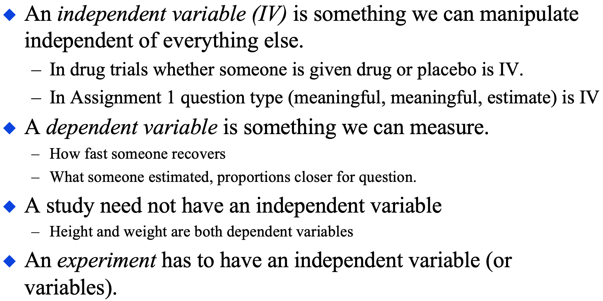
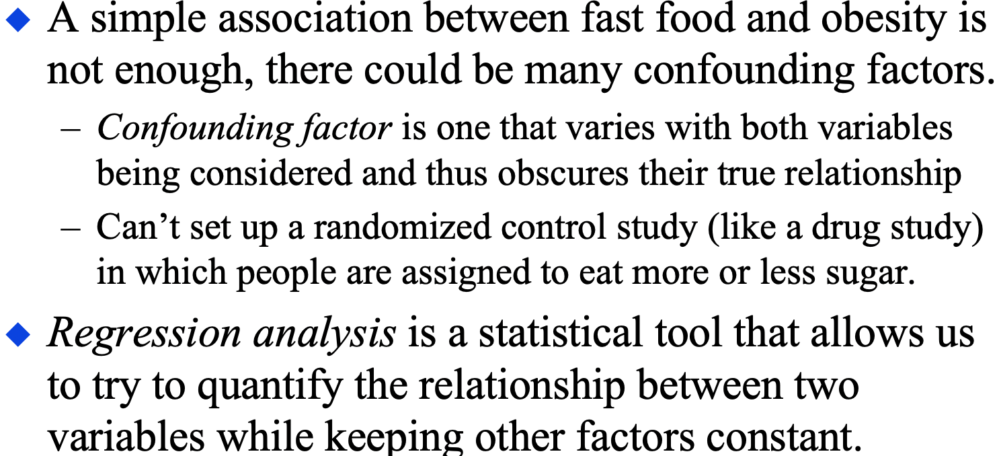
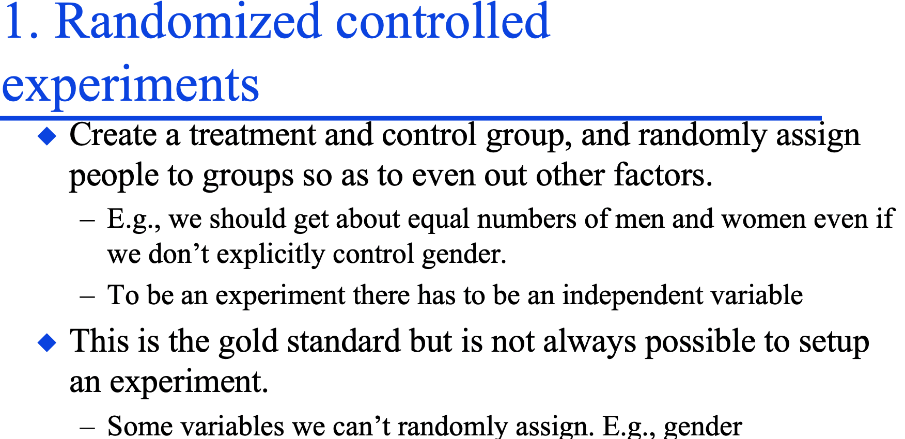
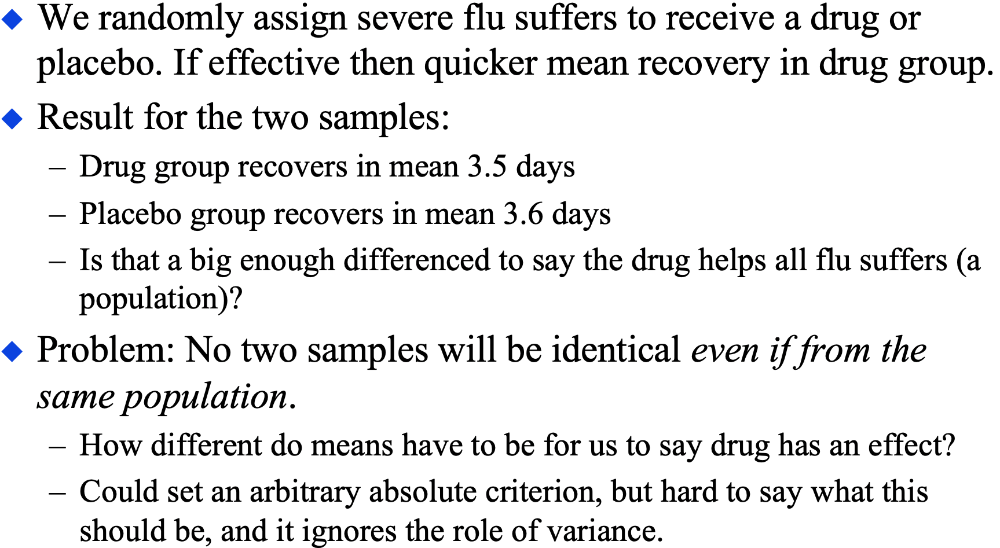
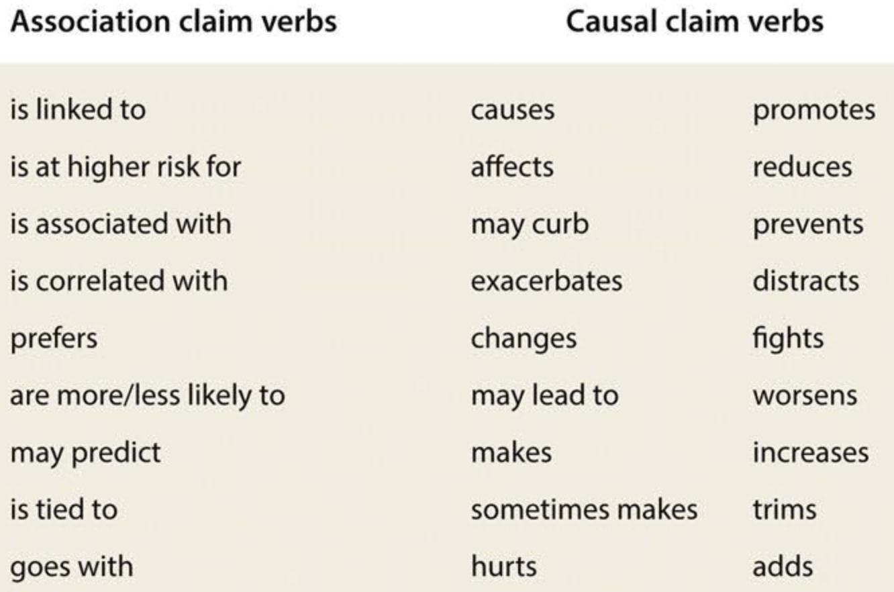
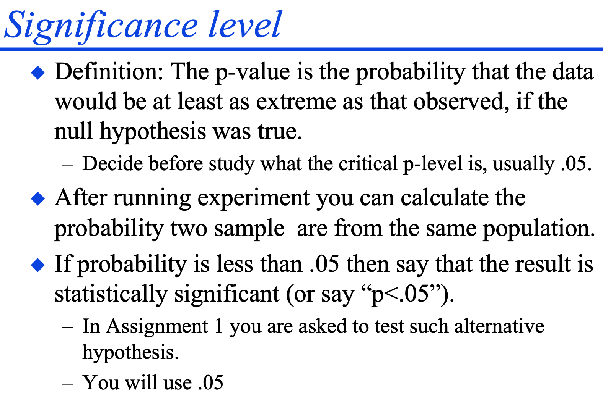
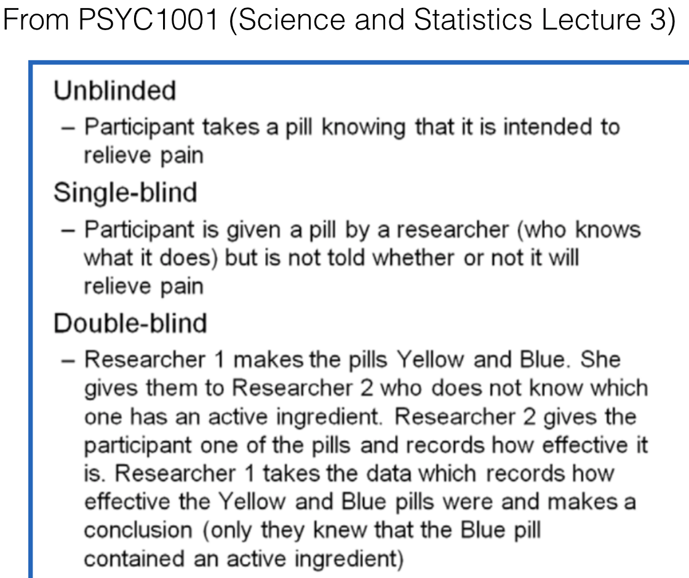

```{r setup, include=FALSE}
knitr::opts_chunk$set(echo = TRUE)
```
(this document is updated as the weeks proceed)

* Also see guide to Alex Holcombe and his lectures, posted on Canvas

Week 7: Stats and studies: Correlation and causation <!--statsAndStudies PPT-->

<!-- video: Correlation and causation  -->
<!-- video: Confound or nuisance variable? -->
* Correlation and causation intro
  * Learning objectives:
    * Understand and apply three causal models to explaining correlations
    * Know the term "spurious correlation" 
* Where does data come from?
* Understanding correlation more deeply
  * Correlation of X with Y same as Y with X
  * Measurement and correlation
    * Correlation not affected by changes in units
  * When linear regression is not appropriate: [COVID-19 interactive lesson](https://alexholcombe.shinyapps.io/COVID19questions/)

* Three causal models
  * X causes Y, Y causes X, a third variable causes both
  * The [third-cause fallacy](https://apologetics.fandom.com/wiki/Third-cause_fallacy)
* A causal model can be at any level of detail

<!--Slide #45-->
* Explanatory, Outcome, and Nuisance variables
  * IV (an explanatory variable in an experiment) and DV (an outcome variable in an experiment). Bruce slide:
```{r, echo=FALSE, out.width = "220px"}

```
  * [Nuisance variable](https://dictionary.apa.org/nuisance-variable)
    * Is not different, on average, for the different levels of the variable we are interested in
  * [Confound](https://www.students4bestevidence.net/blog/2018/10/01/a-beginners-guide-to-confounding/) variables
    * Is different for the different levels of the variable we are interested in.
    * Bruce slide:
```{r, echo=FALSE, out.width = "220px"}

```
  * Can you distinguish between confounds and nuisance variables?
  * Random assignment
    * Bruce slide:
```{r, echo=FALSE, out.width = "220px"}

```
* Randomisation and control group
  * Bruce slide
```{r, echo=FALSE, out.width = "200px"}

```

* Time as a third variable
  * Relationship between many observed variables, such as pirates and high average temperature, is confounded by time. 
  * Time: Post hoc ergo propter hoc (After this therefore because of this) fallacy

Week 8 <!--statsAndStudies PPT-->

* Dichotomous correlation
  * dichotomous variables and correlation
  * Contingency tables <!-- Manly Chapter 7 Causes, illusory correlations -->
  * Later you will see the link to arguments and logic

* 4 kinds of control
  * Statistical adjustment - [controlling for](https://alexholcombe.github.io/teachingATHK/readings/controllingForVsControl.html) confounds
  * A controlled variable - matching
* Causal phrases verus correlational phrases, see "Distinguish correlational and causal.." video on Canvas

```{r, echo=FALSE, out.width = "160px"}

```    

  * Recognizing observational studies in the news
  * "Controlling for" in regression and multicollinearity

* Epidemiology
  * Smoking has a big effect,
  * Nutrition effects are small
  * Many false positives, which we'll explain later

Week 9 

* Hypothesis testing review and extension
  * Review of hypothesis testing (recall tutorial week 5 and Bruce's 18 March lecture)
  * Bruce slide:
```{r, echo=FALSE, out.width = "220px"}

```  
  * False positives, false negatives, true positives, true negatives
  * Hypothesis testing and medical testing
    * Sensitivity and specificity
  
* Why does the news have lots of false positives? 
  * Excess of statistical comparisons <!-- https://twitter.com/guido_meijer/status/1383834011793981441 single neurons in mice brain encode price of cryptocurrencies -->
  * More reasons for errors in science given later in the class, after logic and arguments

### Arguments and logic, Weeks 9-10

We're going to go back and forth between bare-bones examples and arguments from the wild, giving you more and more tools to deal with the real-world ones.

A 9 min [intro video on youtube](https://www.youtube.com/watch?v=NKEhdsnKKHs), but it uses different terminology than we use in this unit.

* We need to know good reasons for believing things. Ideally,
  * Assumptions are true
  * Logic must be airtight (inescapable)
* Syllogisms introduction
  * Suppositionally inescapable; inescapable
* Truth contingency tables 
* Necessary and sufficient
* Syllogisms 
  * Suppositionally inescapable, inescapable, suppositionally solid, solid

* Towards real-world arguments 
* The vegetarianism argument, student responses, and the difficulty of decoupling
* Redundant premises
* Implicit premises

### Arguments and reasoning in the wild, Weeks 11-13

Week 11

* Poly-syllogism
* Casting an argument

* Mindset for real-world (4 slides)
  * I will happily change, for I seek the truth - Aurelius.
  * Most arguments are people just trying to win - to get what they want. Persuasion.
  * But ideally you don't just want to win, you actually want to learn and find things out.
  
Fallacies. <!-- "8_9_10_Fallacies" folder with Keynote file -->

* Loose language in the wild
  * hyperbole
  * principle of charity (related to steel man, discussed later)

* Casting the we must bomb Iran argument

* Induction and deduction <!-- https://rintintin.colorado.edu/~vancecd/phil1440/induction.pdf -->
  * Process of elimination, Sherlock Holmes
  * Abduction

Weeks 12 and 13

* Deduction and induction in science
  * [reading](https://www.livescience.com/21569-deduction-vs-induction.html)
* Analysing scientific abstracts

<!-- * Mindset again - System 1 vs. System 2 [reading](https://www.apa.org/monitor/2012/02/conclusions) -->

* Analysing the Molly and Bea argument
* Hawthorne and Expectancy effects  <!--slides 181 to 191-->
    * Experimenter
    * Participant
    * Addressing expectancy effects: blinding
    
* Rhetoric, mere rhetoric, and informal fallacies
* Boosters and hedgers
* Post hoc ergo propter hoc, again
  * [Video](https://www.youtube.com/watch?v=5A7hSaoRv0g) combining this fallacy with deductive and inductive logic. Good way to bring previous bits of the class together!

* Ad populum
* Ad hominem "To the person": 
  * Puerile name-calling <!--Include a Gilbert tweet -->
<!--  * Questioning the motive , Gilbert tweet 
  * Hypocrite (including [whataboutism](https://en.wikipedia.org/wiki/Whataboutism))
  * You’re not entitled to speak on that -->
  * Vaccilation
  * Appeal to authority
    * Appropriate versus inappropriate
* Straw man
  * Relation to principle of charity
* Fallacy of the single cause <!-- Relation to affirming the consequent -->
* Circularity
* Minimising evidence against
  * Overwhelming exception
  * No True Scotsman
* Slippery slope
  

```{r, echo=FALSE, out.width = "160px"}

```     

