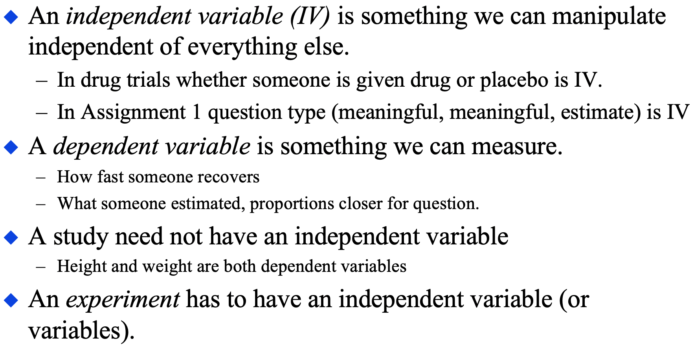
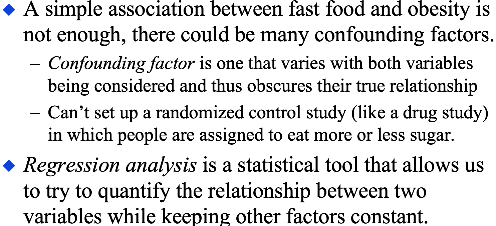
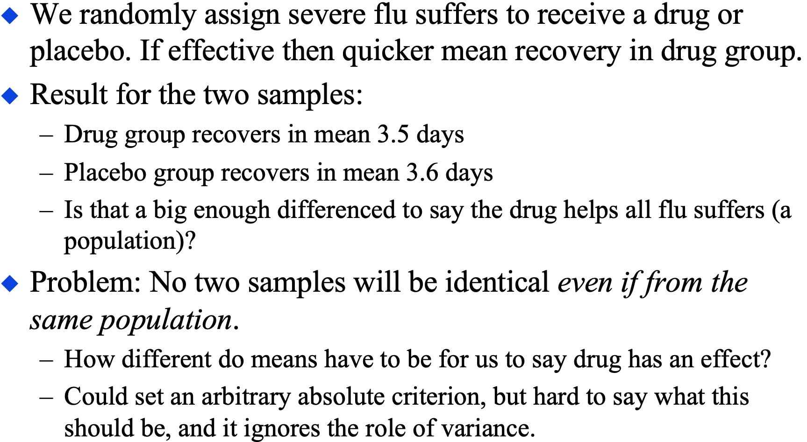
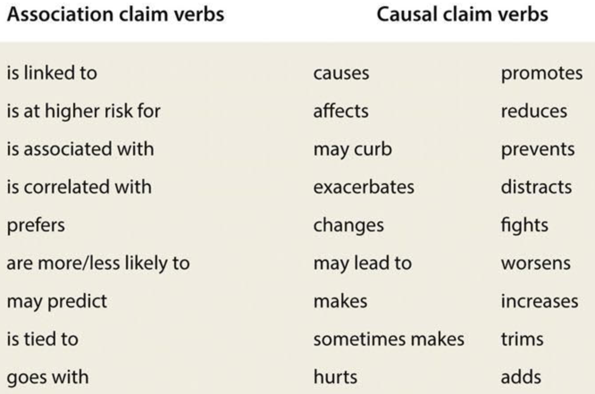
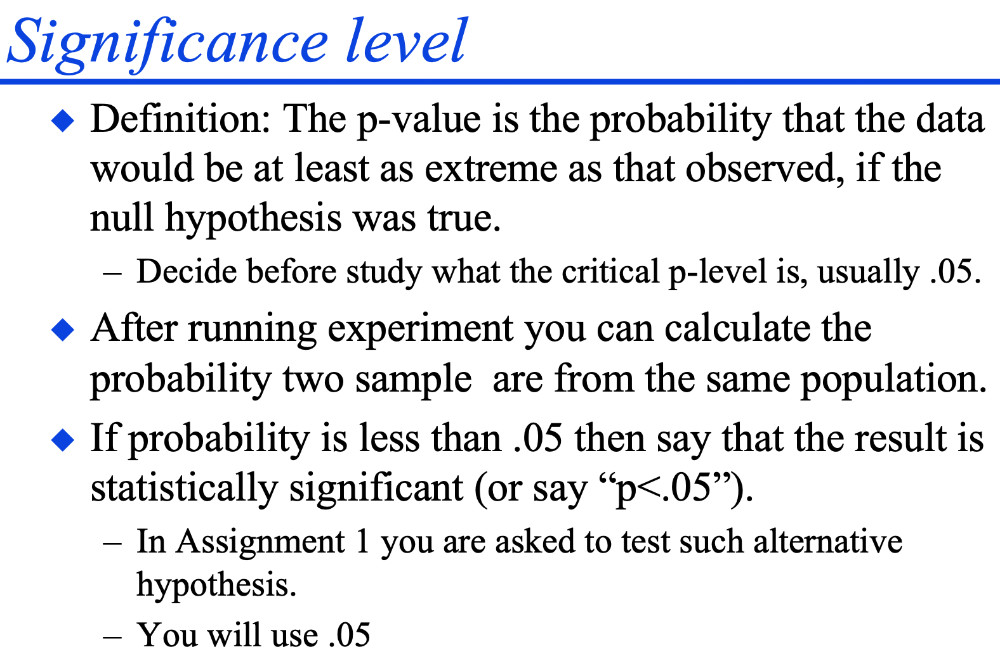

```{r setup, include=FALSE}
knitr::opts_chunk$set(echo = TRUE)
```
(this document may be updated some as the weeks proceed)

* Also see [guide to Alex Holcombe and his lectures](https://canvas.sydney.edu.au/courses/72032/pages/guide-to-weeks-7-13)

## Tutorials

Week 7 tutorial: Causal models, scientific studies, and confounds

Week 8 tutorial: Necessary and sufficient, if-then, and only-if [explained by Khan academy](https://www.khanacademy.org/test-prep/lsat/lsat-lessons/logic-toolbox-new/a/logic-toolbox--article--if-x-then-y--sufficiency-and-necessity) and [by Carneades](https://www.youtube.com/watch?v=ibjL90iY1d0)

Week 9 tutorial: Deductive and inductive arguments, suppositionally inescapable, inescapable, suppositionally strong, and strong.

Week 10 tutorial: Implicit premises, inductive arguments, identifying conclusions in real-world arguments

<!-- Week 11 tutorial: The effect of prior beliefs on argument evaluation -->

<!-- Week 13 tutorial: Rhetoric and informal fallacies -->

## Topics each week

Week 6: Stats and studies: Correlation and causation <!--statsAndStudies PPT-->

* Correlation and causation intro
  * Learning objectives:
    * Understand and apply three causal models to explaining correlations
    * Know the term "spurious correlation" 
* Where does data come from?
* Understanding correlation more deeply
  * Correlation of X with Y same as Y with X
  * Measurement and correlation
    * Correlation not affected by changes in units (as long as the unit conversion is linear: involves only multiplication and addition/subtraction)
  * When linear regression is not appropriate: [COVID-19 interactive lesson](https://alexholcombe.shinyapps.io/COVID19questions/)

* Three causal models
  * X causes Y; Y causes X; A third variable causes both
  * The [third-cause fallacy](https://en.wikipedia.org/wiki/Correlation_does_not_imply_causation#Third_factor_C_(the_common-causal_variable)_causes_both_A_and_B)
* A causal model can be at any level of detail

<!--Slide #45-->
* Explanatory, Outcome, and Nuisance variables
  * IV (an explanatory variable in an experiment) and DV (an outcome variable in an experiment). Bruce slide:
```{r, echo=FALSE, out.width = "220px"}

```
  * [Nuisance variable](https://dictionary.apa.org/nuisance-variable)
    * Is not different, on average, for the different levels of the variable we are interested in
  * [Confound](https://www.students4bestevidence.net/blog/2018/10/01/a-beginners-guide-to-confounding/) variables
    * Is different for the different levels of the variable we are interested in.
    * Bruce slide:
```{r, echo=FALSE, out.width = "220px"}

```
  * Can you distinguish between confounds and nuisance variables?
  * Random assignment
    * Bruce said:
```{r, echo=FALSE, out.width = "220px"}
knitr::include_graphics("imagesForRmd/BruceRandomizedControlledExperimentsWithoutRegression.png")
```
* Randomisation and control group
  * Bruce said
```{r, echo=FALSE, out.width = "200px"}

```

* Time as a third variable
  * Relationship between many observed variables, such as pirates and high average temperature, is confounded by time. 
  * Time: Post hoc ergo propter hoc (After this therefore because of this) fallacy

Week 7 <!--statsAndStudies PPT-->

* Dichotomous correlation
  * dichotomous variables and correlation
  * Contingency tables <!-- Manly Chapter 7 Causes, illusory correlations -->
  * Later you will see the link to arguments and logic

* 4 kinds of control
  * Statistical adjustment - [controlling for](https://alexholcombe.github.io/teachingATHK/readings/controllingForVsControl.html) confounds
  <!-- * "Controlling for" in regression and multicollinearity -->
  * A controlled variable - matching

* Causal phrases versus correlational phrases ("Distinguish correlational and causal.." video on Canvas)

```{r, echo=FALSE, out.width = "160px"}

```    

  * Recognizing observational studies in the news

* Epidemiology ("Epidemiology and nutrition" video on Canvas)
  * Smoking has a big effect,
  * Nutrition effects are small
  * Many false positives, which we'll explain later

Week 8

* Hypothesis testing review and extension
  * Review of hypothesis testing (recall tutorial week 4 and Bruce's associated lecture)
  * Bruce slide:
```{r, echo=FALSE, out.width = "220px"}

```  
  * False positives, false negatives, true positives, true negatives
  * Hypothesis testing and medical testing
    * Sensitivity and specificity
  
* Why does the news have lots of false positives? ("Hypothesis testing review +" Canvas video)
  * Excess of statistical comparisons ("False positives and jelly beans" Canvas video) <!-- https://twitter.com/guido_meijer/status/1383834011793981441 single neurons in mice brain encode price of cryptocurrencies -->
  * More reasons for errors in science given later in the class, after logic and arguments

### Arguments and logic, Weeks 8-9

We're going to go back and forth between bare-bones examples and arguments from the wild, giving you more and more tools to deal with the real-world ones.

A 9 min [intro video on youtube](https://www.youtube.com/watch?v=NKEhdsnKKHs), but it uses different terminology than we use in this unit.

* We need to know good reasons for believing things. Ideally,
  * Assumptions are true
  * Logic must be airtight (inescapable)
* Syllogisms introduction
  * Suppositionally inescapable; inescapable
* Truth contingency tables 
* Necessary and sufficient
* Syllogisms 
  * Suppositionally inescapable, inescapable, suppositionally solid, solid

* Towards real-world arguments 
* The vegetarianism argument, student responses, and the difficulty of decoupling
* Redundant premises
* Implicit premises

### Arguments and reasoning in the wild, Week 10 <!-- -11 -->

* Polysyllogism
* Casting an argument - the we must bomb Iran argument

* Mindset for real-world (4 slides)
  * I will happily change, for I seek the truth - Aurelius.
  * Most arguments are people just trying to win - to get what they want. Persuasion.
  * But ideally you don't just want to win, you actually want to learn and find things out.
  
* Loose language in the wild
  * hyperbole
  * principle of charity (related to steel man, discussed later)

* Induction and deduction <!-- https://rintintin.colorado.edu/~vancecd/phil1440/induction.pdf -->
  * Process of elimination, Sherlock Holmes
  * Abduction

<!-- EVERYTHING AFTER THIS WAS DROPPED WHEN CALEB JOINED, see outlineWk12and13droppedWhenCalebJoined -->


