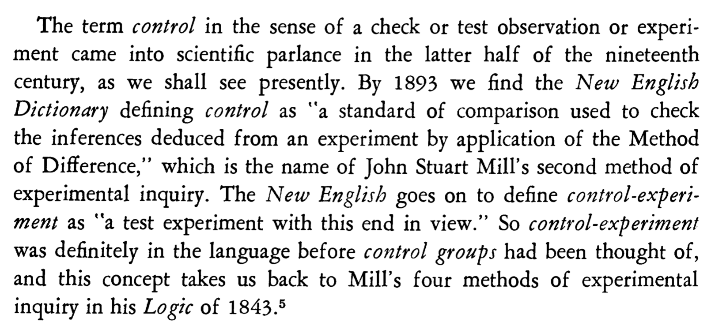

# Ways the word "control" is used in research and experiment design

The word "control"  means different things when it appears in different terms, specifically "control group", "controlled" variables, and "controlling for" a variable!

## The independent variable of an experiment is *controlled* in the ordinary modern English sense

In an experiment, the independent variable is literally controlled by the experimenter. That is, it is manipulated. This is the use of the word in science that makes the most sense to a modern English speaker.

## Control groups

If there are two groups in the experiment, manipulating a variable often leads to what you can call an "experimental group" (e.g., with a drug being tested on people) and the "control group" (a comparison group of people who don't receive the drug).

A control group is the group in an experiment that does not receive treatment by the researchers and is then used as a benchmark to measure how the other tested subjects do.

To modern English speakers, this use of the word "control" is not intuitive. The terms “Control group” and "control condition" date from an old meaning of the word “control”, to check – still the predominant meaning for cognates in languages such as German.

That meaning of “control” [survived in modern English](https://forum.wordreference.com/threads/passport-control.2188162/) in the “Passport Control” lines at airports, where passports are checked, not controlled. So, when you hear “control group”, it may help to think “Passport Control”. The control group is a check that the factor you are interested in is responsible for the outcome in the experimental group.

Already in 1954, an historian of science had to explain to people where the word "control group" came from (as well as "control experiment").

## *Controlling for* in an observational study

In an observational study, **“controlling for”** a variable (also "adjusting for" and "taking into account") is used to describe how in multivariate regression, a variable’s effect is examined and discounted to reveal the effect of the variable of interest. It’s not literally control, because it’s a statistical trick, not actual manipulation of the variable. It is necessary because in an observational study, it's impossible to ensure that the data points with the different levels of the X variable do not also differ on some other factor Z.

For example, if one wants to look at the effect on cancer rates (Y) of different amounts of fast food consumption (X), it’s impossible to ensure that the people who ate lots of fast food and the people who didn’t were equivalent on other factors (Zs) such as amount of exercise, gender, race, alcohol intake, etc. These alternative factors may be responsible for any difference in obesity between fast food abstainers and fast food frequenters. So we have to use the statistical trick of “controlling for”. But this has problems, as described in Alex's lectures.

In an experiment, we literally do **control** a variable. In rats for example, we could manipulate the proportion of fast food in their diet. If the two groups of rats were completely identical, that's all that's needed.

But because the rats are not all identical (no two rats are identical, not even clones), experiments also rely on **randomization**. The reason for randomization is to balance extraneous variables between the different values of the controlled variable. For example, in the case of the rat fast food study, the study design might be to give some rats no fast food in their diet and give other rats only fast food. But how should we decide *which* rats to give the fast food to?

A naive approach would be to order, say, 10 batches of 10 rats and give the first five batches that we receive the fast food and following that, do the study on the remaining five batches with no fast food. *Can you recognise a problem with this?*

A first problem is that the first batches of rats might conceivably be different from the last batches of rats. Perhaps the first batches of rats were exposed to more carcinogens prior to their arrival to your laboratory than were the last batches of rats. For example, the rat breeder might have started cleaning the rat cages with a somewhat carcinogenic cleaner, after shipping the first batches of rats. That would be a *confounding* variable, because it is an *extraneous variable that differs between the two groups you're comparing*. A confounding variable might also occur due to you conducting the study with the no fast food rats after you conducted the study with the first, fast food rats. Maybe it is getting more toward summer as the study goes on, and the later (fast food) rats will then be exposed more to the ultraviolet rays of the sun (if you have a window in your laboratory), which can cause cancer.

To address this, experimenters use **randomization**. The rats are randomly assigned to the fast food feeding and no fast food groups. This, on average, will roughly equate the extraneous variables, such as carcinogen exposure, across the two groups.

## *Controlled variables* that are neither the independent variable nor the above category of variables statistically controlled for

The term "controlled variables" is often used for quantities that a scientist wants to be constant in the two groups. This is also called matching. For the fast-food experiment on rats, a good researcher will ensure that before the experiment commenced, both groups of rats had the same diet.
If you did not, one of the possible explanations of a difference in cancer rate would be difference in amount of carcinogens ingested before the experiment began. Similarly, during the actual experiment, amount of UV light exposure should "be controlled" - both groups of rats should get the same amount of exposure to sunlight.
